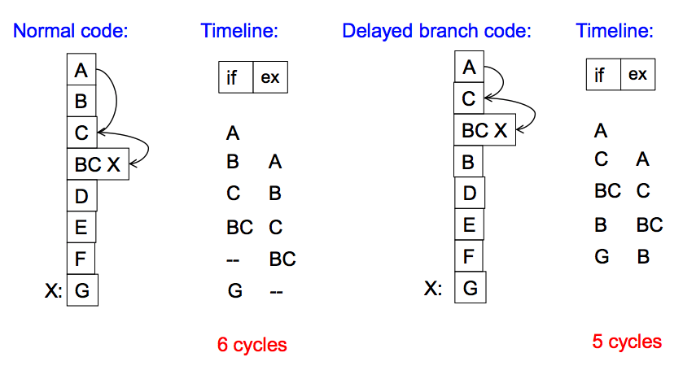

# Lecture 09 - Branch Prediction

Viene a manejar las dependencias de control.

Problemas:

- Cual debería ser el fetch PC del siguiente ciclo?
- Si la instrucción que fue fetcheada es control-flow, como determinamos el
  siguiente fetch PC?

Potenciales soluciones:

- **Stall** del pipeline hasta que sepamos el siguiente fetch address
- Adivinar el siguiente fetch address (**branch prediction**)
- Usar delayed branching (**branch delay slot**)
- Hacer algo diferente (**fine-grained multithreading**)
- Eliminar las instrucciones de control-flow (**predicated execution**)
- Hacer fetch de los dos branches posibles (si se saben sus direcciones)
  (**multipath execution**)

## Branch prediction (not taken)

La técnica más simple es asumir que siempre va ser non-taken (predicción
**always-not-taken**).

    next_pc = pc + 4

Es una forma de **next fetch address prediction**. Como hacerlo más efectivo?

- Maximizar las chances de que la siguiente instrucción secuencial sea la
  siguiente a ser ejecutada
  - Software (compiladores): Armar el CFG (Control Flow Graph) de forma tal
    que la siguiente instrucción a ser ejecutada está en el path non-taken de
    un branch.
- Eliminar las instrucciones de control-flow (o minimizar su ocurrencia), y de
  esa forma todo es secuencial
  - **Predicate combining**: si el branch depende de muchas condiciones, en vez
    de tener un branch que hace jmp con cada una, combinarlas a un solo
    predicado, y branchear en base a él.

    Deshacerse de las instrucciones de control innecesarias.

  - **Predicated execution:**: Convertir la dependencia de control en una de
    datos.

## Predicated execution

Convertir la dependencia de control en dependencia de datos. Es buena para
programas con CFGs simples.

Por ejemplo,

    cmov condition, r1 <- r2
    r1 = (condition == true)? r2 : r1

Un programa como

    if a == 5
        b = 4
        jmp
    else
        b = 3

Se puede transformar en

    cmpeq cnd a, 5
    cmov cnd b, 4
    cmov !cnd b, 3

Para así pasar de dependencia de control a dependencia de datos (los cmov
dependen de cnd)

- Ventajas
  - La predicción always-not-taken funciona bien, ya que no hay branches
  - El compilador tiene más libertad de optimización, ya que ahora no necesita
    saber el destino de los branches.
  - Las optimizaciones de código solo están obtaculizadas por data dependences.
- Desventajas / Limitaciones:
  - Trabajo inútil: Se ejecutan algunos no-ops ya que hay instrucciones siempre
    se convierten en ellos.
  - Requiere soporte adicional de la ISA (instrucciones como cmov)

Y no todos los branches (ex. loop) se pueden eliminar de esta manera.

## Branch delay slot (delayed branching)

Cambia la semántica de la instrucción de branch.

Idea: Retrasar la ejecución de un branch. N instrucciones (delay slots) que
vienen después de la branch son **siempre** ejecutados sin importar la
branch direction.

El compilador mueve las instrucciones que no tienen dependnecias al delay slot.

Problema: Cómo encontrar instrucciones para llenar los delay slots?

- Unconditional branch: Simplemente a partir del target
- Conditional branch: Puede ser difícil, ya que el cómputo de la condición no
  debería depender de las instrucciones en los delay slots.

### Fancy delayed branching

Con **squashing**, si el branch not-taken, no se ejecuta el delay slot.

Esto es bueno para loops, porque no se podría usar el delay slot.

Se llena con el A de la próxima iteración.

- Ventajas
  - El pipeline puede estar lleno de instrucciones útiles de una forma simple,
    asumiendo que
    1. \# delay slots == \# instrucciones para mantener lleno el pipeline antes
       de que se resuelva el branch
    2. Todos los delay slots pueden llenarse con instrucciones útiles

- Desventajas
  - Es difícil de llenar hasta con 1 solo delay slot (y con un 2-stage pipeline)
  - Mientras más etapas tenga el pipeline (y ni hablar de superscalar) más delay
    slots son necesarios, y es aún más dificil encontrar instrucciones que no
    tengan dependencias.
  - Y si un branch toma una cantidad variable de ciclos para ejecutar?
  - Ata la semánticas de la ISA a la implementación de hardware.
    Si cambia la implementación del pipeline, se vuelve un peso para el
    diseñador de hardware tener que mantener los delay slots, y además tienen
    que hacer más cosas para mantener el pipeline lleno.

Se hace imposible usar los delay slots.

También, hay que tener cuidado con poner instrucciones en el delay slot que
podrían causar excepciones, como por ejemplo una división por cero.

Es por cosas como esta que es dificil debuggear código optimizado, podemos
obtener una excepción en un punto en el que no esperamos, ya que el compilador
puede haber movido las instrucciones para que se ejecuten en un orden levemente
diferente, no se cambia la semántica del programa pero si de las excepciones.

## Fine-grained multithreading

**Idea**: El hardware tiene multiples thread contexts. En cada ciclo, el fetch
engine realiza el fetch de un thread diferente.

Evita tener que lidiar con dependencias.

Consiste en agregar multiples thread contexts al hardware, y en cada ciclo
fetchear de un thread diferente. Si son independientes, no es necesario chequear
ninguna dependencia de control o datos.

Lo que se está haciendo es que entra una instrucción de branch al pipeline, que
tiene cierta latencia, y se overlappea esa latencia con la de otras inst
de otros threads.

Los GPUs hacen esto, y tienen suficientes threads ya que lidian con muchos datos.

**Idea**: Switchear a otro thread cada ciclo para que no haya dos instrucciones
del mismo thread en el pipeline concurrentemente.

Para cada thread, el procesador se ve como una máquina sin pipeline.

Hay un tradeoff del throughput del sistema vs la performace de cada thread
individual.

Es necesario tener suficientes threads, porque sino no hace el overlap de
las latencies. Aún así funcionaría, pero tal vez se estaría fetcheando
no-ops.

- Ventajas
  - No es necesaria lógica para resolver dependencias de datos o control dentro
    de un thread
  - No es necesaria lógica de branch prediction
  - Ciclos que hubiesen sido gastados en un stall se usan para ejecutar
    instrucciones útiles de otros threads
  - Mejora el system throughput, latency tolerance, y utilización del pipeline
    (asumiendo que se tienen suficientes threads)
- Desventajas
  - Complejidad extra de hardware: multiples contextos (PCs, register files),
    logica de selección de threads. Más caro.
  - La performace de un solo thread se ve afectada. Se fetchea una instrucción
    de un thread cada n ciclos, donde n es el ancho del pipeline (que es
    necesario para resolver dependencias).
  - Puede haber contención de recursos entre los threads en cuanto a caches y
    memoria.
  - Alguna lógica de chequeo de dependencias *entre* threads se mantienek
  - Solo funciona si **no** hay dependencias entre los threads. De haberlas,
    habría que chequearlas.

## Branch prediction

Pero lo que tiene de malo es que si se predice erróneamente, tiene un
**branch penalty**, que es flushear todo el pipeline y fetchear del
path correcto. Esto lleva tiempo, y hasta puede causar pérdida de performance.

Cómo **manatener el pipeline lleno** en presencia de branches?

- **Adivinar la siguiente instrucción** cuando se haga el fetch del branch
- Requiere adivinar la dirección y target de un branch.

### Análisis de performance

- Guess correcto: no penalty (~86% de las veces)
- Guess incorrecto: 2 bubbles (espacios en blanco en el pipeline)

Asumimos

- No hay stalls por dependencia de datos
- 20% control flow instructions
- 70% taken

Cual es el CPI? (Cycles Per Instruction)

    CPI = [1 + (0.2 * 0.7) * 2]
        = [1 + 0.14 * 2]        0.14 = proba de un wrong guess
                                   2 = penalty de un wrong guess
        = 1.28

Con un pipeline más ancho esto empeora.

Una forma de mejorar la performance del branch prediction es reducir cualquiera
de esos dos (la probabilidad y/o penalty de un wrong guess).

### Reducir penalty

Haciendo el fetch antes

### Reducir probabilidad de equivocarse

**Idea**: Predecir el siguiente fetch address

Requiere predecir tres cosas en la etapa de fetch

1. Si la instrucción fetcheada es una branch.\
   Puede resolverse con un BTB, ya que si provee un target address, debe ser
   un branch.

   También se pueden guardar bits de "branch metadata" en el caché de
   instrucciones / memoria. Se hace una decodificación parcial.

2. Dirección del branch (Si es condicional)

3. El branch target address (si fue taken o predecida taken).\
   Puede resolverse con un BTB.

La mayorías de la ISA hace que las branches condicionales sean directas, y
tienen target address variables para la misma instrucción.

### Branch Target Buffer (BTB)

_O Branch Target Address Cache_

**Idea**: Almacenar el target address de la instancia anterior y accederlo
con el PC.

Se bufferean los target addresses de los branches, y accedemos a la estructura
con el PC

Al hacer el fetch de una instrucción, se indexa en la estructura con el PC y
si está presente se obtiene directamente el target. Además, si está presente
sabemos que la instrucción es de branch (sino no estaría el target address).

### Predicción de dirección

Esquemas

- Compile time (static)
  - Always not taken
  - Always taken
  - BTFN (Backward taken, forward not taken)
  - Profile based (likely direction)
  - Program analysis based (likely direction)
- Run time (dynamic)
  - Last time prediction (single-bit)
  - Two-bit counter based prediction
  - Two-level prediction (global vs. local)
  - Hybrid

#### Static branch prediction

- **always not taken**
  - Muy simple de implementar, ni siquiera es necesario un BTB ni predicción de
    dirección.
  - Muy baja accuracy, ~30-40% para branches condicionales.
  - Se puede subsanar ya que compilador puede cambiar el layout del código para
    que el likely path sea el not-taken, de esa forma teniendo una predicción
    mas eficiente. Esto no se puede hacer con loops.

- **always taken**
  - No es necesaria predicción de direcciones
  - Mejor accuracy, ~60-70%
    - Backward branches (i.e loops) suelen ser taken
    - Backward branches: target address < PC

- **BTFN**
  - Backward branches suelen ser taken (loops)
  - Forward branches suelen ser not taken, o el compilador puede cambiar el
    layout del código para que sea de esa manera.

- **Profile based**
  
  Idea: De alguna forma el compilador determina la dirección del branch usando
  un profile run. Encodea esa dirección como un hint bit en el branch
  instruction format.

  Debe ser soportado por el ISA.

  Introduce el concepto de no tratar a todos los branches de la misma manera.
  Cada uno tiene un bit diferente.

  - Ventajas
    - Es mas accurate que los anteriores si el profile es representativo
  - Desventajas
    - Requiere hint bits en el formato que deben ser soportados por el ISA
    - La accuracy depende en el dynamic branch behaviour, hay un solo hint.\
      No se puede decir "para los primeros N es taken, el resto no."
    - La accuracy depende de la representatividad del profile input set.

- **Program based** (o program analysis based)

  Idea: Usar heurísticas basadas en analisis de programas para determinar una
  dirección predecida estáticamente.

  En vez de hacer un profile run del programa y decidir empíricamente, se usan
  heurísticas en el compilador para analizar el programa.

  Ejs:
  - Si está comparando dos punteros, usualmente el segundo es null, suele ser
    una buena idea predecir not-taken.
  - Predecir que un loop va a ser taken.

  - Ventajas
    - No requiere profiling
  - Desventajas
    - Las heurísitcas pueden no ser representativas o ser malas.
    - Requiere soporte en la ISA y análisis del compilador (lo cual también es
      así para otros métodos estáticos)

- **Programmer based**

  Se depende del programador, el cual provee la predicción estática a través de
  *pragmas* en el lenguaje que califican a un branch como likely-taken
  vs likely-not-taken.

  - Ventajas
    - No requiere ningún tipo de analisis
    - El programador (si sabe lo que hace) es el que mejor conoce su código.
  - Desventajas
    - También es necesario ahora soporte del lenguaje
    - Es una carga para el programador

  Los pragmas son keywords que permiten al programador expresar pistas a los
  niveles inferiores de la transformation hierarchy.

      if (likely(x)) { ... }
      if (unlikely(y)) { ... }

La desventaja común de todas es que son estáticas. No pueden adaptarse a
comportamientos dinámicos en el comportamiento del programa.

#### Dynamic branch prediction

Predecir las branches en base a información dinámica obtenida en runtime

- Ventajas
  - Se pueden hacer predicciones basadas en la historia de ejecuciones de
    branches. Se puede adaptar a comportamientos dinámicos
  - No es necesario hacer profiling o análisis o heurísticas estáticos
- Desventajas
  - Se debe hacer desde hardware, es más complejo

##### Last time predictor

Un solo bit por branch guardado en el BTB que indica a que dirección tomó la
última vez que se ejecutó (taken o not-taken)
  
    TTTTTNNNNN -> 90% accuracy

La desventaja es que siempre predice erróneamente la última y primera iteración
de un loop branch. La accuracy para un loop con N iteraciones es

    (N - 2) / N

Es muy bueno para iteraciones con un N grande, pero malo con N chico.

    TNTNTNTNTNTNTNTNTNT -> 0% accuracy

Y la state machine es la siguiente

El problema que tiene es que pasa de T -> NT o NT -> T demasiado rápido.
Esto es en especial un problema para loop branches.

##### Two bit counter branch predictor

También llamada _bimodal prediction_

Le agrega histérisis (tendencia a conservar una de sus propiedades) al predictor
para que una predicción no cambie con un solo resultado diferente.

Para esto basta con usar bits de historia en vez de uno solo.

Cambia de predicción después de 2 errores consecutivos

Se puede implementar con aritmética de saturación

- 11 pred taken (saturate)
- 10 pred taken
- 01 pred not taken
- 00 pred not taken (saturate)

La desventaja es mayor costo de hardware

Es suficientemente buena? ~85-90% accuracy

### Conclusiones

- Last-time y 2BC predictors usan predicciones "last-time"
- El resultado de un branch puede correlacionarse con los del resto de los
  branches del programa.
  - **Global branch correlation**

- El resultado de un branch puede correlacionarse con resultados pasados del
  mismo branch (además de el resultado del branch el "last-time" que fue
  ejecutado). Por ejemplo, puede tener un patrón
  - **Local branch correlation**

Qué tan importante es el problema de la predicción de branches?

Asumimos

- N = 20 (20 pipe stages)
- W = 5 (5 wide fetch)
- 1 de cada 5 instrucciones es un branch
- Cada bloque de 5 instrucciones termina con un branch

Cuanto se tarda en fetchear 500 instrucciones?

- 100% accuracy del predictor de branches
  - 100 ciclos (todas se fetchean en el path correcto)
  - No se desperdicia trabajo
- 99% accuracy
  - 100 (correct path) + 20 (wrong path) = 120 ciclos
  - 20% extra instructions fetched
- 98% accuracy
  - 100 (correct path) + 20 * 2(wrong path) = 140 ciclos
  - 40% extra instructions fet ched
- 95% accuracy
  - 100 (correct path) + 20 * 5 (wrong path) = 200 ciclos
  - 100% extra instructions fetched

Incluso con solo un 5% de predicciones incorrectas, se pierde la mitad del
throughput del procesador.
