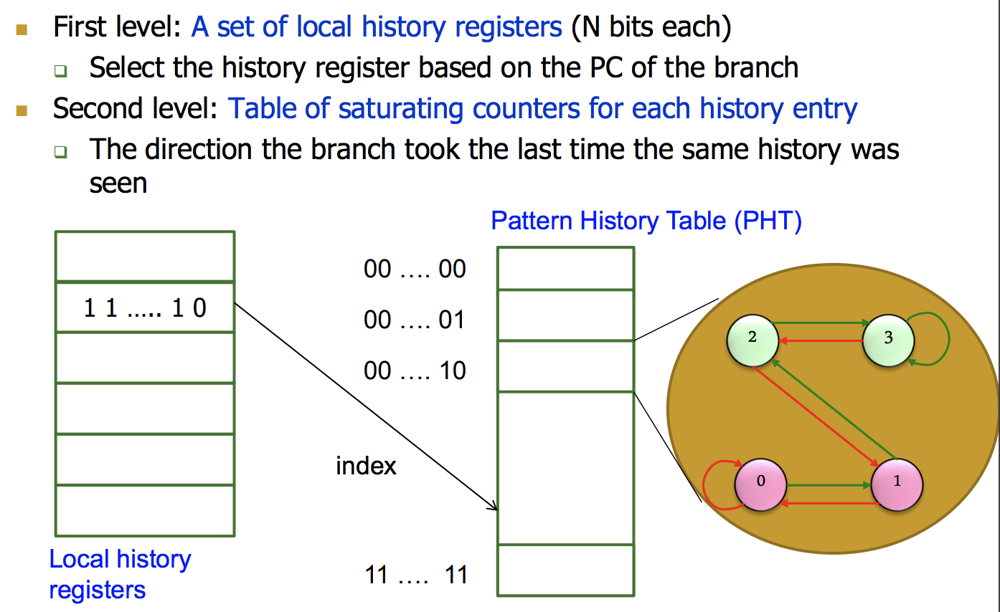

# Lecture 10 - Branch Prediction II

## Global Branch Correlation

- Los resultados de los branches actuales se correlacionan con los de los
  branches siguientes

      if cond
      ...
      if cond and cond2

  Si el primero no es taken, el segundo tampoco
  
    if cond
        a = 2
    if a == 0

Idea: asociar los resultados de los branches con "historia global T/NT de todas
las branches"

Hacer una predicción basada en el resultado del branch la última vez la misma
historia global fue encontrada.

Implementación: Mantener un trackeo de la "global T/NT history" de todos los
branches en un registro, el **Global History Register** (GHR)

Puede ser un índice a una tabla que dice los resultados.

### Mejorar accuracy

Idea: Agregar más información de contexto al global predictor para que considere

- GShare predictor: GHR hasheado con el Branch PC
  - Más info de contexto
  - Incrementa el access latency

### Two-Level GShare branch predictor

## Local Branch Correlation

Idea: Tener un per-branch history register, para asociar el resultado predecido
con el "T/NT history" del mismo branch

Hacer una predicción basado en el resultado del branch la última vez la misma
branch local fue encontrada.

Esto se llama **local history/branch predictor** y usa dos niveles de historia,
per-branch history register + history at that history register value.

## Hybrid

Idea: Usar más de un tipo de predictor (i.e multiples algoritmos) y seleccionar
la "mejor" predicción.

- Ventajas
  - Mejor accuracy, diferentes predictores son mejores para diferentes branches
  - Hay menos **warmup** time (los predictores que tengan un warmup más rápido
    pueden ser utilizados hasta que estén los mas lentos)
- Desventajas
  - Es necesario un "meta-predictor" o "selector"
  - Latencia de acceso mayor.

## Biased branches

- Obs: Muchas branches están biased en una dirección (ex. 99% taken)
- Problem: Estas branches contaminan las estructuras de predicción, causando
  interferencia y haciendo que la predicción de otras sea peor.
- Solution: Detectar estas biased branches y predecirlas con un predictor
  más simple (ex. last-tine, static, ...)

## Resumen

Manejo de dependencias de control en maquinas con pipeline

- Delayed branching
- Fine-grained multithreading
- Branch prediction
  - Compile time (static)
  - Run time (dynamic)
    - Last time predictor
    - Hysterisis: 2BC predictor
    - Global branch correlation -> two level global predictor
    - Local branch correlation -> two level local predictor
    - Hybrid branch predictors
- Predicated execution
- Multipath execution
- Return address stack & indirect branch prediction