# Memoria

## El sistema de memoria

### Jerarquía

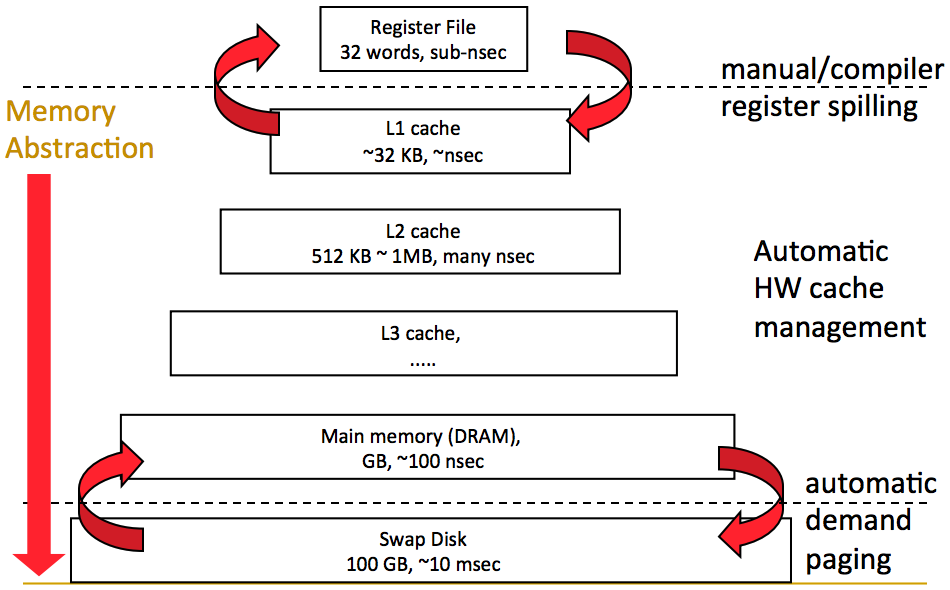

### Principios de vecindad o localidad

El controlador de caché trabaja basándose en dos principios

- **Principio de vecindad temporal**

  Una dirección de memoria que está siendo accedida ahora probablemente será
  accedida devuelta pronto.

  Ej: loops

- **Principio de vecindad espacial**

  Si se está accediendo a una dirección de memoria, probablemente se acceda a
  las direcciones cercanas pronto.

  Ej: vectores

## Tecnologías de memoria

### Clasificaciones

- **No volátiles**
  - Retienen la información almacenada cuando pierden alimentación.
  - Actualmente modificables en tiempo real.
  - Parten de **ROM** (Read Only Memory) que debían ser grabadas por el
    fabricante del chip y no eran modificables.
  - Las actuales memorias **flash** pueden ser grabadas por algoritmos de
    escritura on the fly por el usuario. Se suelen usar para SSDs.
  - Se usan para almacenar el programa de arranque.

- **Volátiles**
  - **RAM**: Random access memory. Una vez interrumpida la alimentación se
    pierde la información que almacenaban.
  - Pueden almacenar más información y modificarla en tiempo real a mayor
    velocidad que las no volátiles
  - Clasificación según tecnología
    - DRAM: Dynamic Ram
      - \+ Consumo mínimo
      - \+ Capacidad de almacenamiento alta
      - \+ Costo por bit bajo
      - \- Tiempo de acceso alto (lento)
      - \- Requiere refresh
    - SRAM: Static Ram
      - \- Consumo alto
      - \- Capacidad de almacenamiento baja
      - \- Costo por bit alto
      - \+ Tiempo de acceso bajo (rápido)
      - \+ No requiere refresh

### Memorias y velocidad del procesador

#### Conexión básica

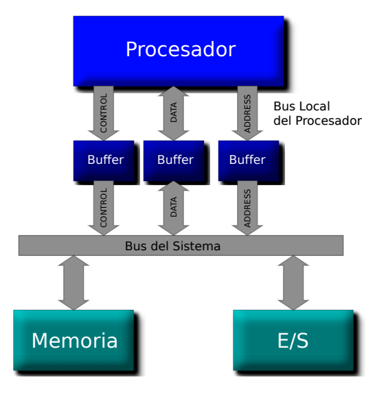

Qué RAM usar?

- Banco de memoria con SRAM, sería muy caro
- Banco de memoria con DRAM, no aprovechamos la memoria del procesador

La solución es la memoria cache!

## Cache

### Funcionamiento

Es un banco de SRAM de muy alta velocidad que contiene una copia de la memoria
principal (datos e instrucciones), la cual debería estar disponible cuando sea
necesaria, permitiendo acceder rápidamente sin tener que esperar a la memoria.

Este debe ser

- Suficientemente grande para que tenga muchos hits con alta performance
- Suficientemente chica como para no afectar mucho el costo y consumo

Terminologías

- **hit**: Se accede a un item que **está** presente en la memoria cache
- **miss**: Se accede a un item que **no está** presente en caché
- **hit rate** = (# accesos con hit) / (# accesos totales)

  La idea es que el hit rate sea lo más alto posible

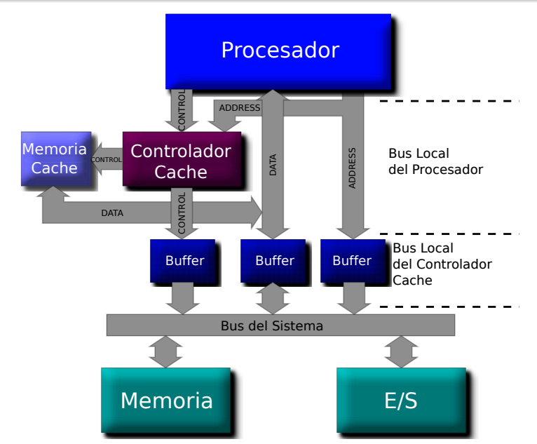

Operación al hacer un acceso a memoria

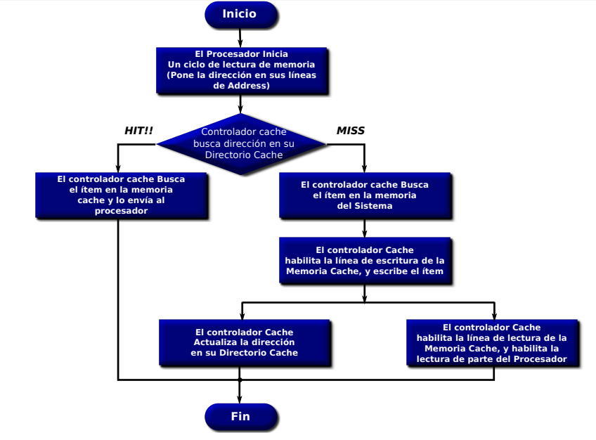

### Organización

Decisiones de diseño

- **Placement**: Donde y como se almacenan / obtienen los bloques de cache?
- **Replacement**: Que datos remover para hacer espacio?
  - LRU
  - Random
- **Granularity of management**: Bloques grandes, chicos, uniformes?
- **Write policy**: Como manejar escrituras
- **Instructions/data**: Se tratan por separado? Juntas?

#### Lineas o bloques

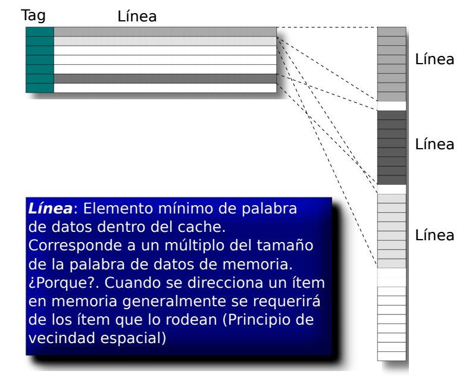

#### Mapeo directo

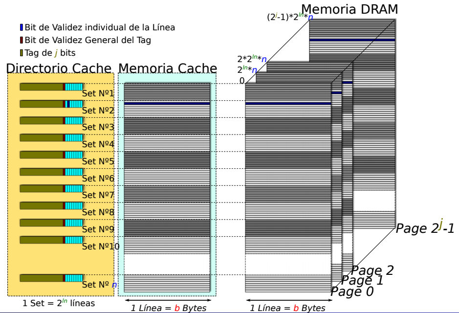
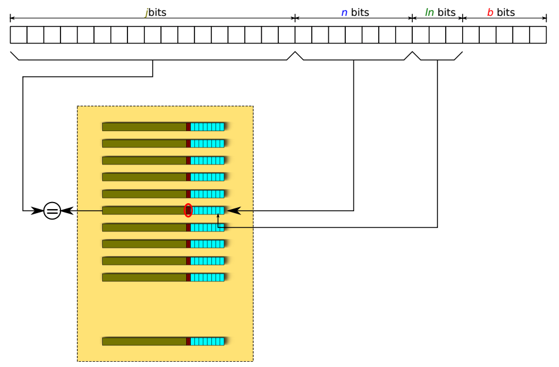

#### Asociativo de 2 vias

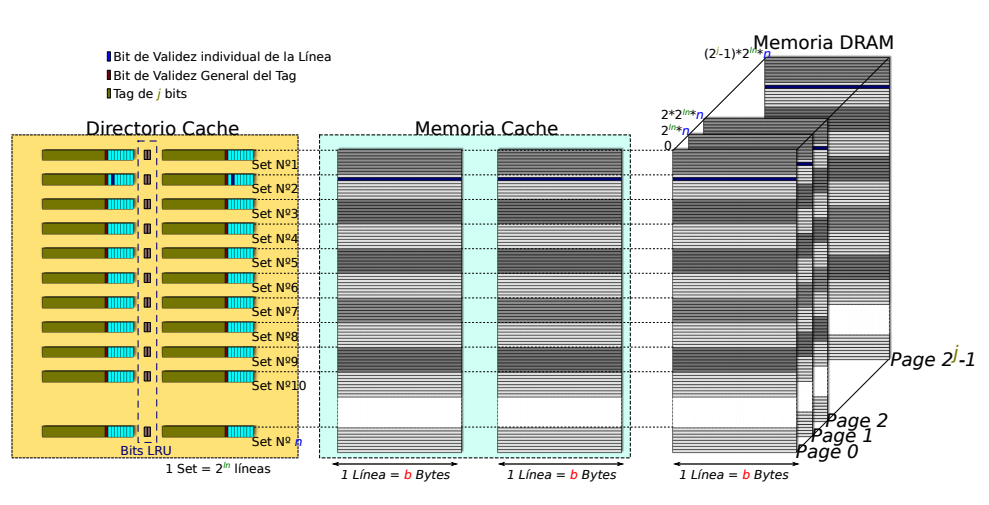

### Coherencia

El problema surge a la hora de escribir, ya que una variable que está alojada
en caché también lo está en alguna dirección de DRAM.
Idealmente, deberían mantener siempre el mismo valor, ser *coherentes*.

Cuando el procesador hace un write, esto deja de cumplirse, y hay varias formas
de actuar, dependiendo de la cantidad de cores del sistema. Estas alternativas
son conocidas como **write policies**

- **Write through** (WT)
  - El procesador escribe en DRAM y el controlador cache lo refresca con el
    dato actualizado.
  - Garantiza coherencia de manera absoluta.
  - Penaliza las escrituras con el tiempo de acceso a DRAM, y se degrada la perf
- **Write through buffered** (WTB)
  - El procesador actualiza la cache, y el controlador lo bufferea para luego
    actualizar DRAM, mientras el procesador continua con otras cosas.
  - El controlador debe disponer de un buffer de escrituras.
- **Write back** / **Copy back** (WB)
  - Cada linea de cache escrita por el procesador se marca como dirty.
  - Solo se actualiza la linea de memoria al momento de desalojar la linea
    de caché, momento en el cual el controlador debe actualizar la copia de DRAM

Si el procesador hace miss mientras el controlador de cache está accediendo a
DRAM para actualizar el valor, debe esperar hasta que termine la actualización
para recibir la habilitacion de las lineas de control para acceder a DRAM.

#### En sistemas SMP (Symmetric Multi-Processing)

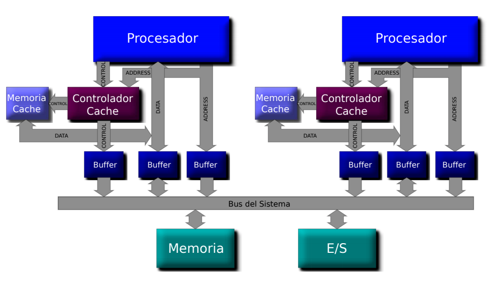

Cuando un procesador modifica una variable, se modifica solo en su caché,
dejándola incoherente con la copia del dato en DRAM y las potenciales copias
de los otros procesadores del sistema.

Conclusiones:

- Independientemente de la write policy (WT, WTB, WB) se debe actualizar lo
  antes posible en DRAM.
- Los otros procesadores necesitan enterarse del cambio, por si tienen la misma
- WB en principio no podría usarse cuando hay más de un CPU, ya que el cambio
  tardaría mucho en ser informado.

#### SNOOP bus

Viene a solucionar el problema anterior

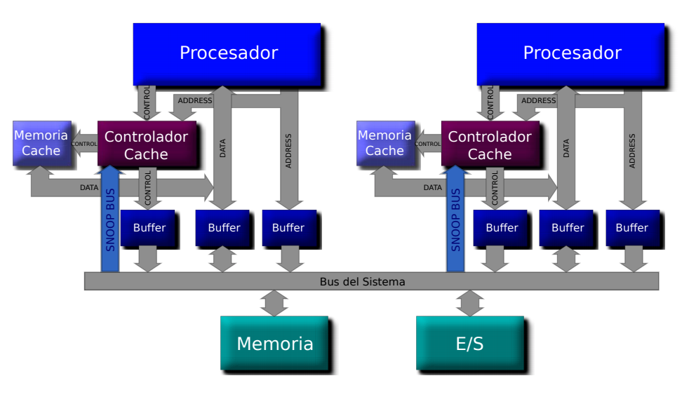

- Conjunto de lineas entrantes al controlador de cache que provienen del
  **bus de address** del sistema.
- También, lineas de **MEMRD** y **MEMWR** del **bus de control** para saber
  si fue una lectura o escritura.
- Cada controlador de cache registra en su directorio las direcciones de memoria
  que tiene almacenadas (mediante los valores de tag / set), y espía (snoop) por
  el Snoop Bus cada operación sobre memoria efectuadas por cualquier procesador.
- Si la dirección física corresponde a una de su caché y **se trata de una**
  **escritura**, entonces invalida la línea correspondiente.

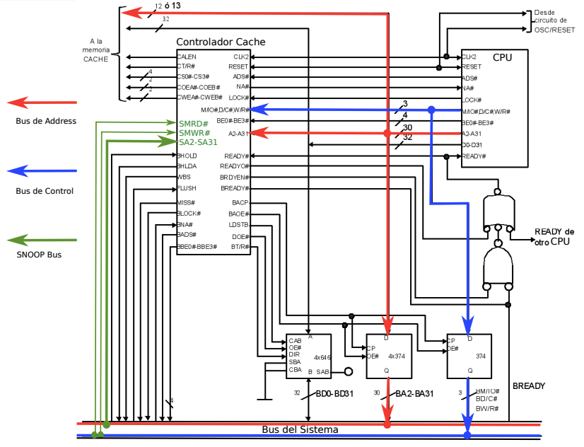

#### Protocolos de coherencia

Existen para poder utilizar WB siempre que sea posible, y reemplazarlo solo
de ser necesario. El más famoso es M.E.S.I

##### Protocolo M.E.S.I

Obtiene su nombre de las clasificaciones que le da a las lineas.

- **M**odified: La linea está presente solo en este caché, que varió de su
  valor en memoria del sistema (i.e dirty). Requiere WB hacia DRAM antes de
  que otro lea de allí el dato.
- **E**xclusive: Está presente solo en este caché, que coincide con DRAM (clean)
- **S**hared: Está presente y *puede* estar almacenada en los caché de otros
- **I**nvalid: No es válida

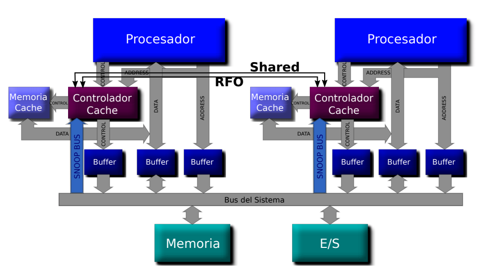

Operación:

- Todas las lecturas del procesador se resuelven desde el cache, excepto si está
  en **invalid**, en cuyo caso se buscan en DRAM
  > Si se implementa MESIF (**F**orwarding) la provee otro controlador de cache
  > en caso de que la tenga (mediante la activación de la señal Shared)
- El estado en el cache que la recibe pasa a **shared** o **exclusive**
- El controlador que posea lineas en estado **exclusive** monitorea a través
  del *Snoop bus* cada transacción sobre DRAM.
  - Si detecta un acceso a una linea que tiene almacenada, cambia el estado a
    **shared** y activa la linea *shared* para broadcastearselo al resto
    > En MESIF activa la lectura en su memoria cache para enviar el valor que
    > tiene por el bus de datos del sistema.
  - El que la está leyendo recibe el broadcast y también la marca como **shared**
- Una linea **shared** o **exclusive** puede pasar a inválida en
  cualquier momento, sin avisarle a nadie.
- Una linea **modified** también, solo que se requiere actualizar
  previamente DRAM.
- Una línea en estado **modified** o **exclusive** puede escribirse desde su
  CPU en cualquier momento. Si estaba **exclusive**, pasa a **modified**
- Si se requiere escritura en una línea que está **shared**, todas las demás
  cachés deben invalidarlo previamente, para lo cual se envía la señal de
  broadcast **RFO** (Request For Ownership)
- Una cache que tiene una linea en **modified** y detecta por el snoop bus una
  lectura de la misma, debe de algún modo *insertar* el dato mantenido por el
  en su línea ya que está incoherente con DRAM. (**modified** y **exclusive**
  usan write back)
  - Activa la linea RFO para avisar que el dato está incoherente
  - Escribe en DRAM el valor actual. El lector copia el valor correcto a su
    cache cuando aparece en el bus de datos.
  - Ambos la ponen en estado **shared**
- Una linea **shared** pasa a **invalid** cuando se recibe un RFO.
- Los estados **modified** y **exclusive** siempre son precisos. Indican que una
  linea de caché está solo en ese caché (i.e ownership).
- Las líneas **shared** son imprecisas. Aunque otros caches la descarten, no se
  informa, ni hay modo que cada caché sepa cuantas lo tienen en shared. Por lo
  tanto *nunca* puede pasar a **exclusive**
- El estado **exclusive** es el más apto para optimizar el mínimo de
  transacciones en el bus ya que al ser escrito cambia a **modified** pero no
  informa nada al resto.

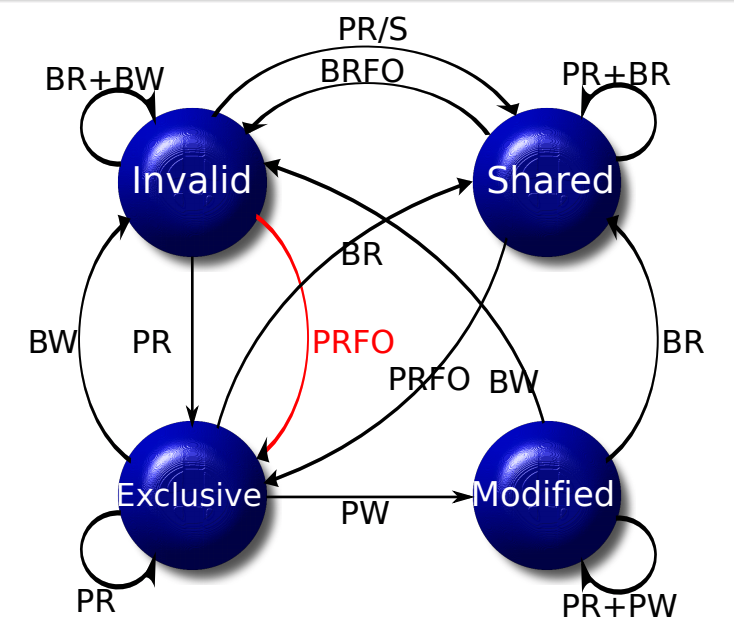

Donde

- **PR**: Processor Read
- **PW**: Processor Write
- **BR**: Bus Read
- **BW**: Bus Write

### Arquitecturas avanzadas
