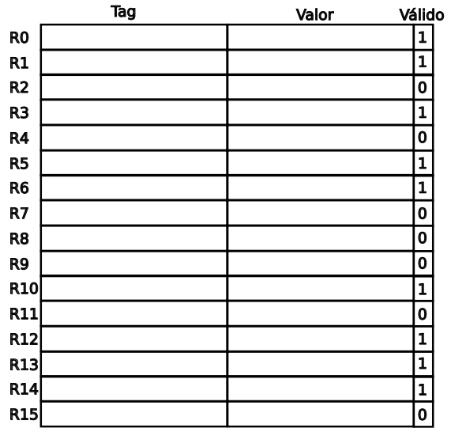

# ILP (Instruction Level Paralelism)

Von Neumann define un modelo básico de CPU basado en una máquina de ejecución
con ciclos


En los primeros procesadores cada etapa se ejecutaba en un ciclo de clock, y la
CPU entera estaba dedicada a esa tarea. Por esto ejecutar una sola instrucción
insumía varios ciclos de clock.

## Pipeline

La primera solución a este problema fue el **pipeline**, que permite superponer
en el tiempo, así posibilitando ejecutar varias instrucciones a la vez.
Así nace el concepto de *Instruction Level Paralelism (ILP)*.

- Requiere que los bloques del procesador que resuelvan la máquina de estados
	para la ejecución de una instrucción (fetch, decode, execute, etc.) puedan
	operar en forma simultánea.

- Es logrado si cada bloque funcional trabaja en paralelo pero cada uno con una
	instrucción diferente.

Parecido al concepto de *linea de montaje*. A cada parte se la denomina etapa o
*stage*.


- El pipeline tarda en llegar a esa condición final tantos ciclos de clock
	como etapas tenga.

- En un pipeline de 5 etapas, y si cada etapa insume solo un ciclo de clock,
	un resultado de instrucción es provisto por cada ciclo de clock, a partir del
	ciclo en el cual se llega a resolver la primera.

- Este escenario es teórico y en la práctica no se cumple todo el tiempo.

### Eficiencia

Hacer que haya mayor cantidad de etapas más simples entonces mejoraría la
performance, idealmente que lleven un solo clock.

Para un tiempo de ejecución por instrucción para una arquitectura sin pipeline,
en principio mientras mas etapas se definan para ejecutar esa operación, al
paralelizarlas con un pipeline el tiempo de ejecución de la instrucción se
reducirá proporcionalmente con la cantidad de etapas

		TPI = (Tiempo x instrucción en la CPU sin pipeline) / (# etapas)

Donde TPI es *Time Per Instruction*

Esta es una situación teórica ideal, en la práctica suele haber *overheads*
introducidos por el pipeline mismo que suman pequeñas demoras.

El pipeline entonces no reduce el tiempo de ejecución de cada instrucción
individual, sino que al aplicarse en paralelo a un flujo de instrucciones,
incrementa la cantidad completada por unidad de tiempo. De esa forma mejora
notablemente el **throughput** del procesador, y los programas ejecutan
notablemente más rápido.

### Obstáculos

Hay obstáculos que conspiran contra la eficiencia de un pipeline, y que terminan
causando un efecto denominado **pipeline stall**, que degrada la performance
del procesador.

#### Obstáculos Estructurales

Por ejemplo, una etapa no está suficientemente atomizada, y requiere más de
un ciclo de clock para completarse.
De haber dos instrucciones que la utilizan que estén más proximas en el tiempo
que lo que tarde en finalizarse, caerán en conflicto de recursos para su
ejecución. Causando que no puedan pasar por esa etapa del pipeline en un solo
ciclo de clock, sino más.

Una de las instrucciones debe detenerse. Como consecuencia, el CPI se incrementa
en 1 o más respecto del valor ideal.

##### Memoria

Un procesador tiene solo una etapa para acceder a memoria y la comparte para
acceso a datos e instrucciones.

Si se necesita un operando de memoria, el acceso para traerlo interfiere con
la búsqueda del operando de una instrucción más adelante del programa, y
también con el fetch de la siguiente instrucción

Por ejemplo, saliendo del siguiente escenario donde las etapas que hacen uso
de memoria están marcadas en rojo,


Cómo no se pueden realizar a la vez dos etapas que hagan uso de memoria,
entonces las que corresponden a instrucciones posteriores se quedan esperando,
y así se aumenta la cantidad de ciclos de clock que lleva.


##### Estructurales - solución

Para todas es necesario agregar hardware.

Para accesos a memoria,

- Separar el cache L1 en datos e instrucciones.
- Emplear buffers de instrucciones impelementados como colas FIFO.
- Ensanchar los buses mas que la word del procesador.

#### Obstáculos de Datos

Se producen cuando por efecto del pipeline, una instrucción requiere de un dato
antes de que esté disponible.

		dadd r1, r2, r3
		dsub r4, r1, r5
		and  r6, r1, r7
		or   r8, r1, r9
		xor  r10, r1, r11

Hay dependencias para el registro `r1`. hasta que la instrucción `add` no
complete su operación, `r1` no tendrá un valor válido, por lo tanto no puede
continuar aplicándolo en las restantes que lo usan.


##### Forwarding

Se extrae el resultado directo de la unidad de ejecución (ALU, FPU, etc.) según
la instrucción ni bien está disponible y se lo envía a la entrada de la etapa
que lo requiera en el mismo ciclo de clock que se escribe en el operando dst.

Esto permite ahorrar el tiempo de escritura del dato destino, y se aplica solo
a las etapas posteriores que quedarían en estado stall. A las etapas que no
quedarían en estado stall como consecuencia de una dependencia de datos, se les
enviaría la salida del resultado normalmente, cuando sea aplicado al operando
destino.

A esto se lo llama **forwarding**


Esto no siempre es factible, por ejemplo

		ld   r1, 0(r2)
		dsub r4, r1, r5
		and  r6, r1, r7
		or   r8, r1, r9
		xor  r10, r1, r11

### Obstáculos de Control

Estos son los **branches**, que son la peor situación en cuanto a pérdida de
performance, ya que representan una discontinuidad en el flujo de ejecución, y
el pipeline busca ejecutar instrucciones en secuencia.

Causa que todo lo que estaba pre procesado deba descartarse, debiendo
transcurrir n - 1 ciclos de clock hasta el proximo resultado, donde n es la
cantidad de etapas del pipeline.
Este fenómeno es conocido como **branch penalty**

#### Branches

El principal inconveniente es cuando es un salto condicional, ya que hay que
determinar si la condición es `true` o `false`.

Si es `true`, se habla de **branch taken** (cambia el registro PC a la dirección
del salto) y sino de **branch untaken** (el PC apunta a la instrucción
siguiente)

Como determinar si es taken?

- En la fase de ejecución si es condicional
- En la fase de busqueda de operando si es un jmp (salto incondicional) o un
	call con direccionamiento indirecto (la dirección de salto está en memoria).
- En la fase de decodificación si es un jmp o call con direccionamiento
	directo (la dir de salto viene a continuación del opcode)

Soluciones posibles

- **Forwarding**: Puede ayudar a disminuir el efecto, pero no es óptima ya que solo
	se disminuyen algunos ciclos del **branch penalty**, y no se elimina del todo
	su efecto.

- Para soluciones más eficientes es necesario recurrir a análisis más detallados
	y minuciosos, que suelen tener en cuenta el comportamiento de los algoritmos
	y los saltos.

## Unidad de Predicción de Saltos

Viene a solucionar el **branch penalty**.

A medida que aumenta la complejidad de un procesador, aumentan las etapas del
pipeline, para así poder paralelizar la mayor cantidad de tareas posibles.
Esto hace que la cantidad de tiempo que pasa en stall luego de un branch penalty
sea directamente proporcional a su cantidad de etapas.

### Criterios

- **predicted-not-taken**

	El procesador asume por defecto que el salto nunca se toma, continúa la
	búsqueda del opcode de las instrucciones siguientes como si el salto fuese una
	instrucción común.
	
	Funciona bien cuando el salto es *hacia adelante*,
	
			instrucción branch
			instrucción sucesora secuencial
			instrucción destino para branch taken

- **predicted-taken**

	El procesador asume por defecto que el salto se toma siempre, continúa la
	búsqueda del código de operación a partir de la dirección target.
	
	Funciona adecuadamente en estructuras de iteración
	
			instrucción de destino para branch taken
			grupo de instrucciones a ejecutar iterativamente
			instrucción branch
	
	La gran ventaja es que siempre se acierta, solo falla cuando expira la
	condición de lazo.

- **delayed-branch**

	Suponiendo la siguiente estructura de programa

			instrucción branch
			instrucción sucesora secuencial
			instrucción destino para branch taken

	La instrucción sucesora se envía al slot de salto demorado, y se ejecuta
	si o si independientemente del resultado de la evaluación del branch, y se
	aplica o no su resultado dependiendo de la evaluación de la condición.

	Si es not-taken, no genera ninguna demora, y si es taken, se descarta la
	ejecución y se tiene un ciclo de clock para que salga el resultado de la
	instrucción de destino.

La decisión de que criterio tomar depende del criterio adoptado en el diseño
del set de instrucciones. El compilador, conociendo el criterio asumido por el
procesador, debe organizar el código de la manera adecuada para aprovecharlo.

### Predicción dinámica

Estos modelos dependen del compilador. El hardware interno del procesador no
realiza ningún análisis de código. Si lo hiciera, y tomase decisiones en
función de lo que encuentra, está un paso adelante en cuanto a predicción de
saltos. Esto es llamado **predicción dinámica**.

#### Branch Prediction Buffer

Modelos:

- Predicción simple de 1 bit

	Es una tabla indexada por la posición de memoria de la instrucción de salto
	y un bit que indica el resultado reciente del salto (**taken** o **not-taken**)

	

	Este bit es una pista para la unidad de ejecución.
	Si el resultado del salto coincide con el valor almacenado, se mantiene,
	y sino se complementa a 1 (i.e se invierte).

	La limitación que tiene es que cuando un salto siempre resulta **taken**,
	y falla una vez, produce dos predicciones fallidas seguidas, ya que el bit
	se invierte.

- Predicción de 2 bits

	Sigue un diagrama de estados como el siguiente

	

Implementaciones en la práctica:

- En la etapa de Instruction Fetch del pipeline, como un pequeño cache de
	direcciones de salto accesible mediante las direcciones de las instrucciones.

- Otra forma es agregar el par de bits a cada bloque de líneas en el cache de
	instrucciones, que se usan solo si ese bloque tiene instrucciones de salto
	condicional.

##### Benchmarks

Benchmarks de branch prediction


Conclusiones:

- Tiene una eficicencia > 82% para diferentes tipos de programas
- Es superior en programas de punto flotante (< 4%) y menor en programas de
	cálculo entero (< 18%)
- El tamaño del buffer de predicción no genera efecto después de los 4KB
- Tampoco se obtienen mejoras aumentando la cantidad de bits de predicción
	más allá de 2. En general, un branch predictor de n bits toma valores entre
	0 y 2^n - 1, tomando el salto para los valores de la mitad más significativa,
	y no para la menos. La complejidad en el diseño no se ve compensada por la
	mejora en la funcionalidad.

### Branch Target Buffer

Caché de instrucciones de salto que contiene para cada entrada el par (dirección
de la instrucción de salto, dirección target resuelta) y **no** tiene los bits
**taken** o **not-taken**.


A este se accede con el valor completo del PC.

- Si el valor no se encuentra, se asume **taken**
	- Si el resultado es **not-taken**, se acepta el stall, y no se almacena nada
		en el BTB.
	- Si el resultado es **taken**, se ingresa el valor al BTB.
- Si el valor se encuentra en el BTB, se aplica el target almacenado
	- Si es **not-taken**, guarda el nuevo valor en el BTB luego de la penalidad
		correspondiente en el pipeline.
	- Si es **taken** no hay penalidad, y no se guarda ningún nuevo valor.

## Superscalar

Se puede trabajar a nivel de microarquitectura y hardware para aumentar la
paralelización, ejecutando más de una instrucción por ciclo de clock.

Se hacen superscalars de n vías,


Aumentan los obstáculos:

- Los obstáculos estructurales quedan más expuestos
- El acceso simultáneo a memoria puede ocurrir entre etapas de distintos
	pipelines, y la probabilidad de ocurrencia aumenta con la cantidad de vías
	del superscalar.
- Se pueden ejecutar en dos ALUs dos instrucciones, pero si una depende de la
	otra entonces no es posible.
- Una falla en el branch prediction es letal. Limpia ambos pipelines.

## Scheduling dinámico

Contexto actual:

- Hasta aquí fueron todos pipelines con scheduling de instrucciones estático,
	simplemente buscan una instrucción, y la envían a la unidad de ejecución
	(proceso conocido como **dispatch**)
- En el caso de tener dependencias con otra instrucción, el envío es demorado
	(**pipeline stall**)
- Y en el caso de superscalars se deben considerar dependencias entre vías.

Todo esto hace que se vuelva insuficiente el método de forwarding que soluciona
los **obstáculos de datos**.

La solución a esto es la ejecución fuera de orden.

## Ejecución fuera de orden

La idea es enviar las instrucciones a ejecutar independientemente del orden en
el que aparecen en el código.
Es una decisión que puede ser tomada después de decodificar, ya que ahí se sabe
si hay alguna dependencia estructural o de datos que haga que no pueda
ejecutarse.


    1   div.d   f0, f2, f4 
    2   add.d   f6, f0, f8
    3   sub.d   f8, f10, f14
    4   mul.d   f6, f10, f8


Esto conlleva dos riesgos potenciales

- La inst 3 escribe su resultado en un operando de la 2
- La 4 escribe su resultado en el destino de la 2

Riesgos:

- **WAR**: (Write After Read)
  
  Representa el riesgo consecuencia de hacer un dispatch de la ejecución de la
  instrucción 3. Si se hace, esta hace **write** en el registro f8, y **after**
  la inst 2 hará **read** de f8, obteniendo un dato incorrecto y alterando el
  resultado de la secuencia de código original generada por el programador.

- **WAW**: (Write After Write)

  Representa el riesgo consecuencia de hacer dispatch de la ejecución de la I4.
  Esta hará **write** en el registro f6, y después **after** la I2 le hará
  **write**, eliminando el resultado de la I4 y alterando el resultado
  determinado por el programador.

- **RAW**: (Read, After Write)

  Se presenta cada vez que una instrucción posterior lee un operando que después
  es escrito por una instrucción previa.

  No es exclusivo a OOO y ya viene de antes.

### Excepciones imprecisas

Es necesario preservar el comportamiento de las instrucciones de modo que los
resultados aparezcan en el mismo orden en el que aparecen las instrucciones
del programa.

El manejo de las excepciones debe preservar el comportamiento de forma que
sea igual a si se hubiese ejecutado in order.

Al ejecutar OOO, el procesador puede generar **excepciones imprecisas**, que son
aquellas que al producirse, el estado del procesador no es el mismo que debería
ser si las instrucciones se hubiesen ejecutado in order.

Motivos:

- El procesador completó la ejecución de una o más instruccioens posteriores a
  la que produce la excepción.
- El pipeline no completó al menos una instrucción previa a la que genera la
  excepción.

El procesador debe asegurar que no se levante una excepción hasta no tener
completado todo el programa incluida la responsable.

### Scorebording

Método más sencillo para implementar OOO.


### Tomasulo

- Minimiza los riesgos **RAW**
- Implementa *register renaming* para **WAR** y **WAW**

Necesidades para implementar OOO

1. Mantener un *link* entre el productor de un dato con sus consumidores
2. Mantener las instrucciones en espera hasta que estén listas para ejecución
3. Estas deben saber cuando sus operandos estén *ready*
4. Hacer dispatch de la instrucción a su Unidad Funcional ni bien todos sus
   operandos estén *ready*.

#### Register renaming

Dado el siguiente código

    1   div.d  F0, F2, F4
    2   add.d  F6, F0, F8   ; WAR hazard por F8 con sub.d
    3   s.d    F6, 0(r1)
    4   sub.d  F8, F10, F14
    5   mul.d  F6, F10, F8  ; WAW hazard por f6 con add.d

Se introducen registros auxiliares para almacenar los datos

```diff
    1   div.d  F0, F2, F4
-   2   add.d  F6, F0, F8   ; WAR hazard por F8 con sub.d
+   2   add.d  S,  F0, T    ; WAR hazard por F8 con sub.d
-   3   s.d    F6, 0(r1)
+   3   s.d    S,  0(r1)
    4   sub.d  F8, F10, F14
-   5   mul.d  F6, F10, F8  ; WAW hazard por f6 con add.d
+   5   mul.d  F6, F10, T   ; WAW hazard por f6 con add.d
```

Y cualquier uso posterior de F8 es remplazado por el registro temporal.

Se tiene un **Register Alias Table**



#### Reservation station

La **Reservation Station** es un subsistema de hardware que está encargado de
implementar el resto de las funcionalidades.

- Mantener instrucciones en espera hasta que estén *ready*
- Indicar cuando una instrucción *waiting* por sus operandos los tiene *ready*
- Hacer dispatch de la instrucción a su Unidad Funcional ni bien todos sus
  operandos estén *ready*.

Operatoria:

- Para cada instrucción tiene bancos o register files internos.
- Cada operando cuyo valor no esté ready tiene un *tag* que corresponde con el
  que se asignó cuando se hizo el renaming.
- Cada vez que una uniodad de ejecución tiene disponible un operando, se hace
  broadcast de su tag y valor por todas las **reservation stations**
- Si un opreando destino recibe múltiples escrituras, la **reservation station**
  aplica solo la última.
- Cuando una instrucción tiene todos sus operandos la RS la despacha a la
  unidad funciona correspondiente.
- Si no hay ninguna disponible la encola y espera a que haya una libre para
  enviarla.

De este modo, no hay posibilidad de que una instrucción cuya ejecución se
adelanta respecto de otra previa en la secuencia del programa pueda modificar o
utilizar un registro de la instrucción previa, y que esta luego use una copia
incorrecta del mismo.

#### Implementación


#### Common Data Bus

Es crucial para poder hacer el broadcast de resultados. Un datapath que cruza
la salida de todas las unidades funcionales y atraviesa las RSs, Floating Point
Buffers, Floating Point Registers, y Floating Point Operation Stack.

#### Algoritmo


    if (RS tiene recursos disponibles antes del renaming)
        Se inserta en la RS la instrucción y los operandos renombrados
        (valor fuente / tag)
        Se renombra sii la RS tiene recursos disponibles.
    else
        stall
    
    while (esté en la RS cada instrucción)
        Mirar el tráfico por el Common Data Bus (CDB) en busca de tags que
        correspondan a sus operandos fuente.

        Cuando se detecte un tag, se guarda el valor de la fuente y se mantiene
        en la RS.

        Cuando todos los operandos están disponibles -> Instrucción ready

    if (Unidad Funcional disponible)
        Dispatch de la instrucción hacia ella
    
    if (Finalizada ejecución de instrucción)
        Unidad funcional arbitra el CDB
        Pone el valor del tag en el CDB (tag broadcast)

        if (Register file conectado al CDB)
            Cada registro contiene un tag que indica el último escritor en él

            if (tag de register file == tag broadcast)
                Registro = valor broadcast
                bit de validez = 1

                Recupera tag renombrado
                No queda copia válida de tag en el sistema


### ReOrder Buffer (ROB)

A medida que se paralelizan más las instrucciones, más complejo se vuelve el
manejo de dependencias.

Los BTBs eran útiles pero es necesario repensarlos.

Se suele hacer una ejecución especulativa, se sigue con las instrucciones que
son dependientes especulando con el resultado que tendrá la primera.
Esto deja de ser necesario una vez que se tiene el resultado, ya que deja de
ser especulativa y da certeza para estar en condiciones de escribir en el
registro destino.

Esto hace que se tengan pre-almacenados resultados de instrucciones posteriores
que luego deben impactarse en sus operandos destino, y **el commit de los**
**resultados debe hacerse en orden.**

Esta es la funcionalidad del **ReOrder Buffer** (ROB).

- Agrega registros para almacenar los resultados de las instrucciones ejecutadas
  en base a la especulación del hardware.
- El resultado permanece en el ROB desde que se obtiene hasta que se hace commit
  (i.e se copia en el operando destino)

Esto a diferencia del algoritmo de tomasulo, que pone el resultado en el
registro directamente, y a partir de entonces el resto lo tenía disponible.
El ROB no lo escribe hasta el commit - y hasta entonces el registro de
arquitectura no tiene valor.


Cada entry del ROB tiene

- **Tipo de instrucción**:
  - Branch: No tiene resultado destino
  - Memory store: calcular la dirección del operando
  - De ALU: el resultado va a un registro de arquitectura.
- **Destino**: Registro de la arquitectura donde se guarda o la dir. de memoria
- **Valor**: Almacena el resultado de la operación hasta el commit
- **Ready**: Indica si se completó y su resultado está disponible

### Implementación de ejecución especulativa

- **Envío**
  - Obtiene las instrucciones desde una cola de prefetch y las ubica en una RS
    vacía y un slot en el ROB.
  - La instrucción se envía junto con los datos correspondientes a sus operandos
    si estos ya están disponibles.
  - Si no hay RS o no hay un slot del ROB, se tiene una dependencia estructural
    y se hace **stall**.

- **Execute**
  - Si faltan operandos monitorea por el CDB hasta que estén
  - Chequea riesgos RAW
  - Ejecuta las operaciones ready en la RS
  
- **Write Result**
  - Escribe el resultado en el slot del ROB una vez disponible
  - Si algún RS espera el resultado, lo escribe allí también

- **Commit**
  - A partir de aquí el resultado solo está en el operando destino
  - Si es un branch con predicción incorrecta flushea la entry del ROB y
    recomienza a partir de la dirección sucesora correcta.
  - Para cualquiera que finaliza correctamente, se copia el valor del ROB en el
    operando destino (ya sea registro o dirección de memoria).

## Procesadores multithread

## Multicore y manycore
