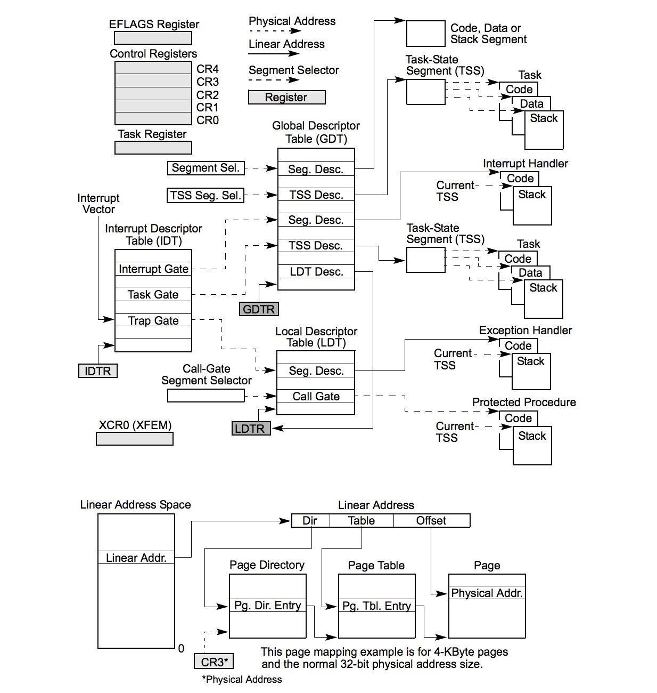
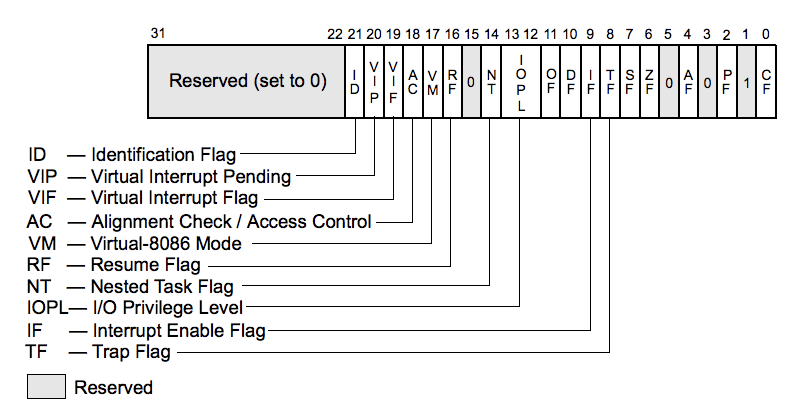
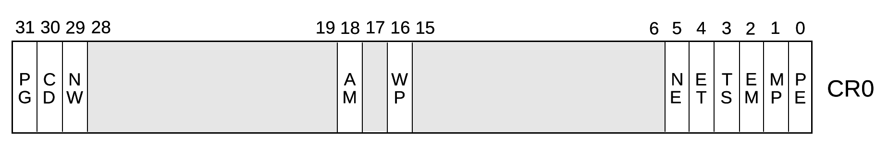

# Arquitectura

## Overview

## Registros

### EFLAGS

### CR0

- `PG`: **Paging**
- `CD`: **Cache Disable**
- `NW`: **Not Write Through**
- `AM`: **Alignment Mask**
- `WP`: **Write Protect**
- `NE`: **Numeric Error**
- `ET`: **Extension Type**
- `TS`: **Task Switched**
- `EM`: **Emulation**
- `MP`: **Monitor Coprocessor**
- `PE`: **Protection Enable**
