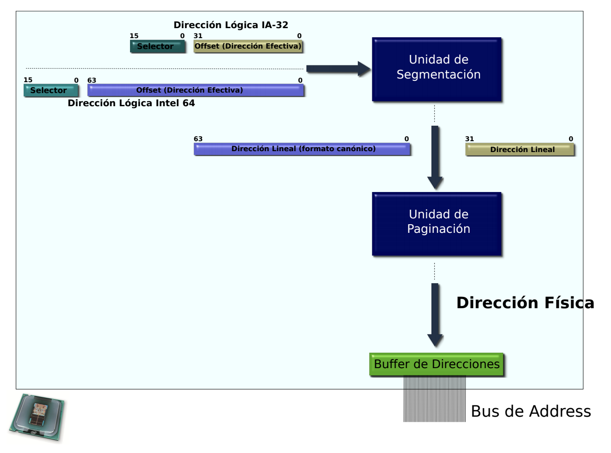

# Memoria

Tipos de direcciones:

1. **Física**

   Es la dirección que será decodificada por el hardware para acceder a
   memoria RAM o ROM según corresponda. El procesador pone esta dirección en los
   pines de address cuando su UC habilita la salida del bus de direcciones.

2. **Virtual o Lineal**

   Generalmente coincide con la lógica, aunque puede ser diferente.

3. **Logica**

   Expresada en términos abstractos por el programador en su código fuente.

## MMU

La MMU (Memory Management Unit) es la encargada de traducir direcciones.

Está compuesta por dos unidades

- **Unidad de Segmentación** (Logica -> Lineal)
- **Unidad de Paginación** (Lineal -> Física)

Donde la resolución de direcciones se hace de la siguiente forma:




### Segmentación

Una dirección en está compuesta de un *selector* de segmento, y un *offset*.

    15     0     31   0
    selector  :  offset

Con lo cual se necesitan 48 bits.
Para ver a que dirección física le corresponde,

    (selector << 4) + offset

#### Selectores

Tienen el siguiente formato


- `index`: Indice en la tabla de descriptores de segmento.\
  Como tiene 13, bits, cada tabla puede alojar 2^13 descriptores.
- `TI` - Table Indicator\
  Selecciona en que tabla de descriptores debe buscarse.
  - `0` GDT (Global Descriptor Table)
  - `1` LDT (Local Descriptor Table) _no se usa nunca_
- `RPL` - Requested Privilege Level\
  Nivel de privilegio que declara tener el dueño del segmento.

Selectores disponibles:

- `CS`: Code Segment
- `SS`: Stack Segment
- `DS`: Data Segment (default)
- `ES`: Datos
- `GS`: Datos
- `FS`: Datos

#### Descriptores

Los selectores de segmento son una referencia a un **descriptor de segmento**.
Estos se almacenan en una tabla, ya sea la **GDT** (Global Descriptor Table)
o la **LDT** (Local Descriptor Table), cuya dirección está especificada en el
`GDTR`. Para cargarlos,

    lgdt - Load GDT
    lldt - Load LDT

El primer descriptor de la tabla debe ser nulo.


- `Base` (Partida en 3) Es la dirección en la cual comienza el segmento.
- `Limit` Es el máximo offset válido desde la base. (La última dirección válida,
  el tamaño del segmento - 1)

Atributos

- `G`: **Granularity**
  - `0`: El máximo offset es igual al límite
  - `1`: El limite está expresado en multiplos de 4K.\
    Luego el máximo offset se puede calcular de varias maneras

    ```
    ((limit + 1) * 4kb) - 1
    ((limit + 1) << 12) - 1
    (limit << 12) + 0xFFF
    ```

- `D/B`: **Default / Big**
  - `0`: Default, segmento de 16 bits.
  - `1`: Big, segmento de 32 bits.
- `L`: Solo utilizado en IA-32e.
- `AVL`: **Available**. No es usado para ningún proposito en específico, queda
  en el programador darle el uso apropiado.
- `P`: **Present**.
  - `1`: El segmento está presente en memoria RAM.
  - `0`: El segmento está en memoria virtual (disco).\
    Esto hace que genere una excepción `#NP` (Segment Not Present) para que
    luego el kernel realice el _swap_ entre el disco y RAM.
- `DPL`: **Descriptor Privilege Level**.\
  Nivel de privilegio que debe tener el codigo que pretende acceder a este
  segmento, de 0 (más privilegiado) a 3 (menos privilegiado).
- `S`: **System**, _activo bajo_.\
  Define si es un segmento de código/datos o de
  sistema. Determina los valores posibles de `Type`.
  - `0`: System.
  - `1`: Codigo / Datos.
- `Type`: Depende de si es de sistema o de código / datos
  - Codigo / Datos

    

    - `A`: Accesed
    - Data
      - `E`: **Expand Down**, cuando va a ser utilizado como pila.
        El puntero de direcciones decrece a medida que va expandiendose el
        segmento.
        {{TODO: Ver en protección}}
      - `W`: **Writable**. Indica si el segmento de datos puede escribirse.
        Si está en `0`, contiene datos pero es Read Only.
    - Code
      - `C`: **Conforming**. Ajustable
        Ajustan su nivel de privilegio al del código que lo invoca.
        {{TODO: Ver en protección}}
      - `R`: **Readable**
  - System

    Valor    | Descripción
    -------- | -----------
    `0b0000` | _Reservado_
    `0b0001` | TSS de 16 bits disponible
    `0b0010` | LDT
    `0b0011` | TSS de 16 bits busy
    `0b0100` | Call Gate de 16 bits
    `0b0101` | Task Gate
    `0b0110` | Interrupt Gate de 16 bits
    `0b0111` | Trap Gate de 16 bits
    `0b1000` | _Reservado_
    `0b1001` | TSS de 32 bits disponible
    `0b1010` | _Reservado_
    `0b1011` | TSS de 32 bits busy
    `0b1100` | Call Gate de 32 bits
    `0b1101` | Reservado
    `0b1110` | Interrupt Gate de 32 bits
    `0b1111` | Trap Gate de 32 bits

#### Operatoria

##### GDT


1. El procesador ve el bit TI para ver a que tabla tiene que ir
2. Como es la GDT, busca en el `GDTR` la dirección base física donde comienza.
3. Indexa en la tabla con la parte del selector de segmento que indica el índice
4. El procesador lee el descriptor de segmento
5. La **Unidad de protección** realiza sus chequeos
   {{TODO: Ver en protección}}
6. El procesador suma el valor del offset contenido en la **dirección lógica**
   con la **dirección base** del segmento, así formando la **dirección lineal**.

##### LDT

En la LDT es parecido, solo que usa el registro `LDTR` para indexar en la GDT,
y luego el descriptor le dice donde está la LDT y el offset dentro de la misma
es tomado del índice de la dirección.

#### Cache

El procesador cuenta con registros de cache ocultos para no tener que ir cada
vez a memoria a buscar las tablas.

#### Flat

Un modo que se suele usar es la _segmentación flat_ en la cual todos los
segmentos abarcan toda la memoria.

### Paginación

Para habilitarla, hay que setear en 1 el bit 31 del `CRO`, `PG`.
Si no se está en Modo Protegido, entonces se lanza una `#GP`

Tiene distintos modos

- 32 bits: Es el modo original del 80386.
- PSE: Permite tener tamaños de página mayores
- PAE
- IA-32e

El **tamaño de página** estándar es de 4KB.

#### Estructuras

Es necesario poder almacenar

- Dirección base
  - Cada página comienza en una dirección siguiente a la del último byte de la
    anterior. Osea que inician en direcciones alineadas a 4KB.
  - Como 4KB = 2^12, los 12 bits menos significativos de la dirección son
    siempre 0.
  - Se le llama entonces **page frame** a los bits mas significativos, que
    determinan la base.
- Limite: No es necesario especificarlo pues tienen tamaño fijo.
- Atributos

Entonces con 20 bits para la dirección base, 12 bits para los atributos se
puede conformar un descriptor de páginas de 32 bits.

Como las páginas son de 4KB, (2^12 bytes), al dividir el espacio lineal de 4GB
(2^32) en páginas quedan 2^20.
Esto llevaría a una tabla de descriptores muy grande, 2^20 descriptores de 4B
son una tabla de 4MB, y habría una por tarea. Por esto se hace paginación por
**niveles**.

1. **Page Directory** (PD)\
   Ocupa 1 página (4KB) con lo cual puede almacenar hasta 4KB / 4B = 1024
   Page Directory Entries (PDE).
2. **Page Table** (PT)\
   Ocupan también 4KB, con lo que pueden almacenar 1024 Page Table Entries (PTE)
   de 4B cada uno.

Se piensa como un sistema de administración de memoria por tarea, de forma que
cada una tenga su propia estructura de páginas. Esto robustece la seguridad del
SO en la administración de memoria.

##### CR3


Tiene dos bits de control de cache

- `PWT` Page-Level Write Through
- `PCD` Page-Level Cache Disable

##### PDE y PTE


- `PS` **Page Size**
  - **`0`**: PT de 4KB
  - `1`: PT de 4MB
- `PAT` **Page Attribute Table** (0)
- `G` **Global**\
  Hace que no se flushee de la TLB cuando se cambia CR3. (ej. `printf`)
- `D` **Dirty**\
  Indica que la página fue modificada. A la hora de desalojar una página de RAM,
  si no fue modificada no la copia a disco.
- `A` **Accessed**\
  Se setea cada vez que la página fue accedida. El SO puede contabilziar los
  accesos para así saber cual página desalojar de ser necesario.
- `U/S` **User / Supervisor**. Privilegio de la página
  - `0`: Supervisor (Kernel). Es equivalente a DPL 0
  - `1`: Usuario. Es equivalente a DPL 1 a 3.

  El procesador chequea el `CPL` del segmento de código para autorizar o no
  el acceso a la página. {{TODO: Protección}}
- `R/W` **Readable / Writable**.
  - `0`: Read Only
  - `1`: Puede ser escrita.

  No hay permisos de ejecución.
- `P` **Present**

  Indica si la página está en memoria (P=1). En caso de no estarlo, se genera 
  una excepción `#PF` (Page Fault) cuando se intenta acceder a una dirección que
  tenga al menos un P=0 a lo largo de las estructuras.

  **Tiene que estar en 1 cuando la configuramos.**

- `PCD y PWT` Igual que en CR3

#### Administración

Se inicia una tarea con lo mínimo indispensable, una PD con una sola PT valida,
y luego se van agregando PTEs dinámicamente, cada una habilitando 4KB más, hasta 
llegar a 4MB de memoria.
Llegado a ese límite, si se solicita más, se crea otra PDE, que permite otros
4MB más.

#### Traducción

El procesador necesita conocer para cada tarea la dirección física en donde
se encuentra el Page Directory. Para esto está el registro de control `CR3`.

La **dirección lineal** se divide en tres campos:

- Indice en el PD
- Indice en el PT
- Offset dentro de la página


#### TLB

Cada vez que se quiere direccionar, es necesario acceder a memoria dos veces
para leer el PDE y el PTE. Para evitarlo, en la unidad de paginación hay un
cache de traducciones, el **Translation Lookaside Buffer** (TLB)

En este se guarda para un directorio y una tabla, la dirección física en la
cual comienza la página.

    directorio_1  tabla_1   dir_fisica_base
                      .
                      .
                      .
    directorio_n  tabla_n   dir_fisica_base  

La escritura de un valor en el registro `CR3` flushea el contenido, excepto
aquellas entradas que se setean como globales.

#### Identity Mapping

Es el equivalente a segmentación flat, consiste en que la dirección lineal
coincida con la física.
