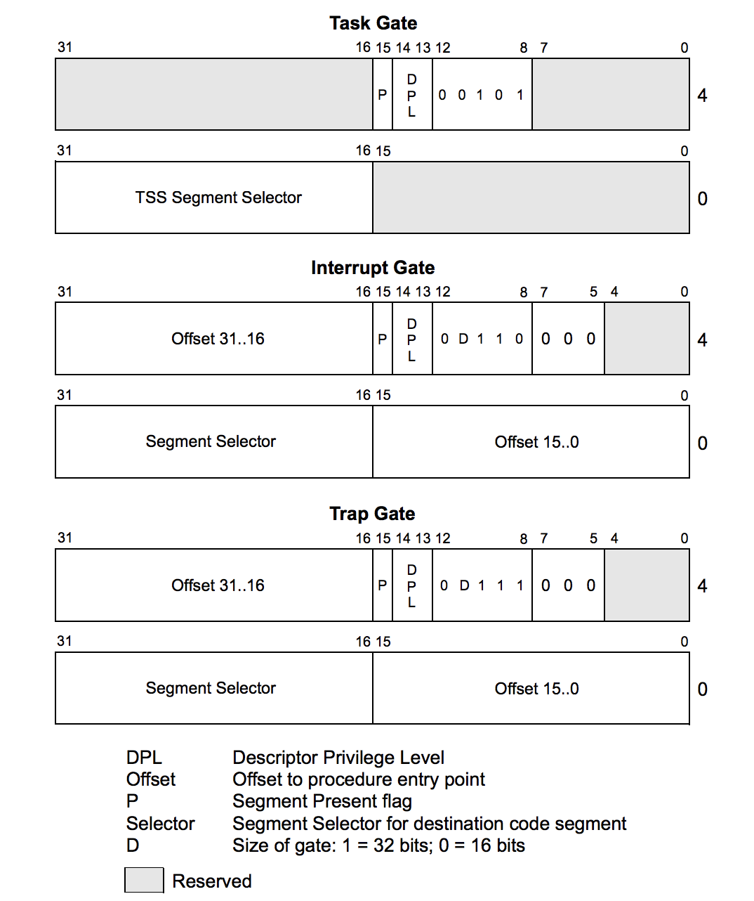
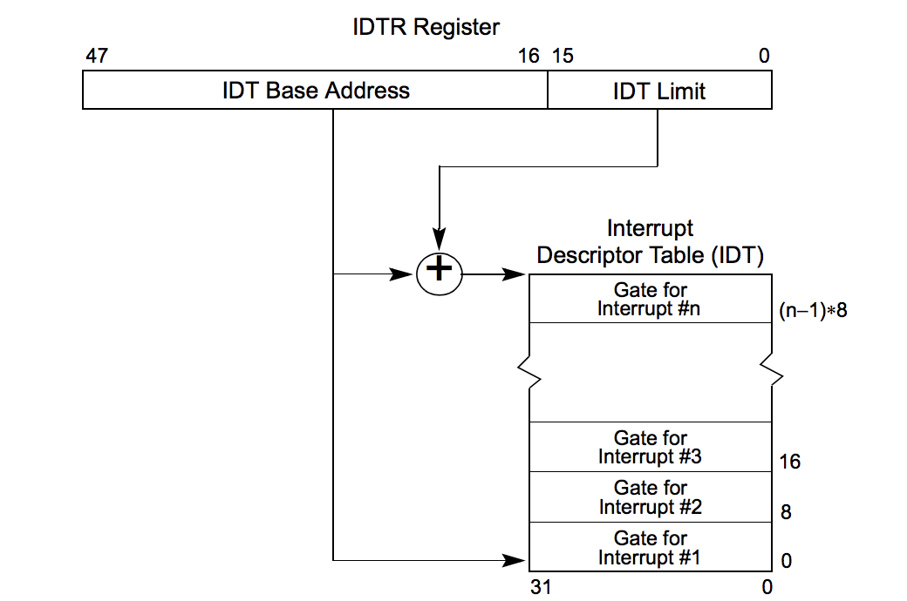
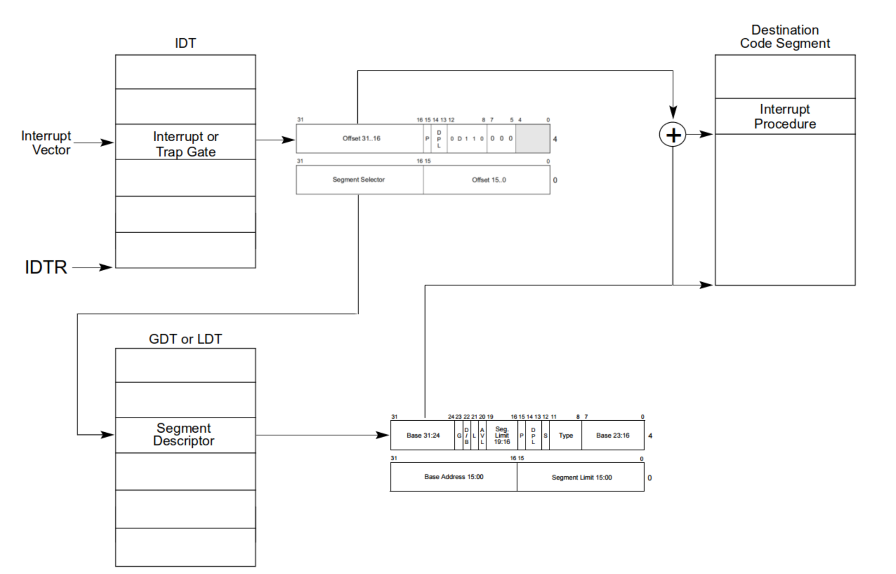
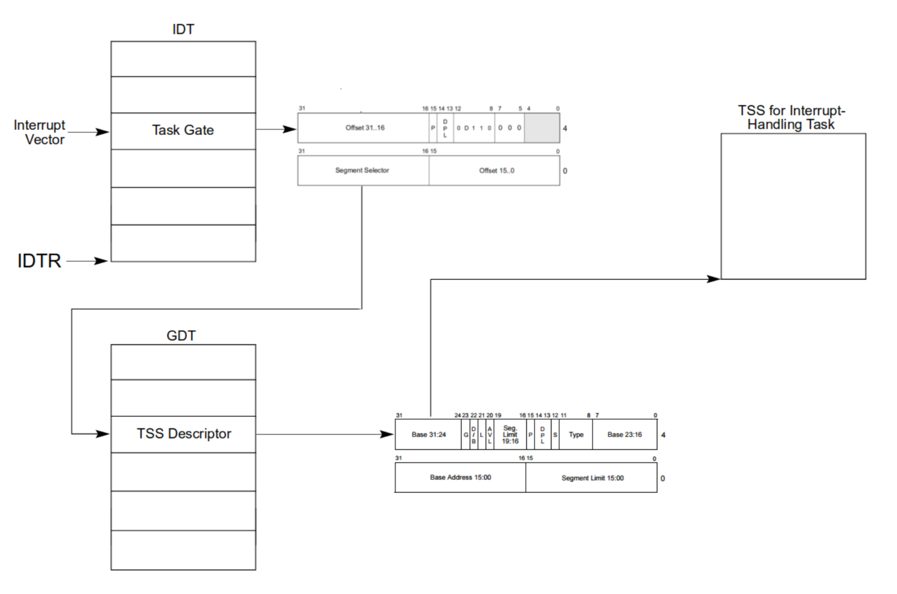
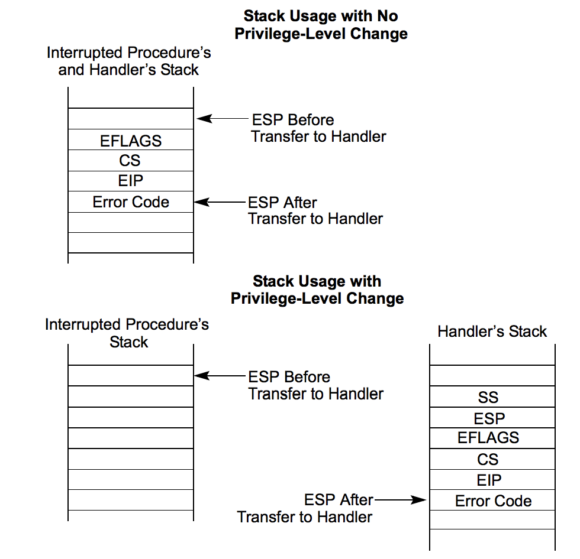
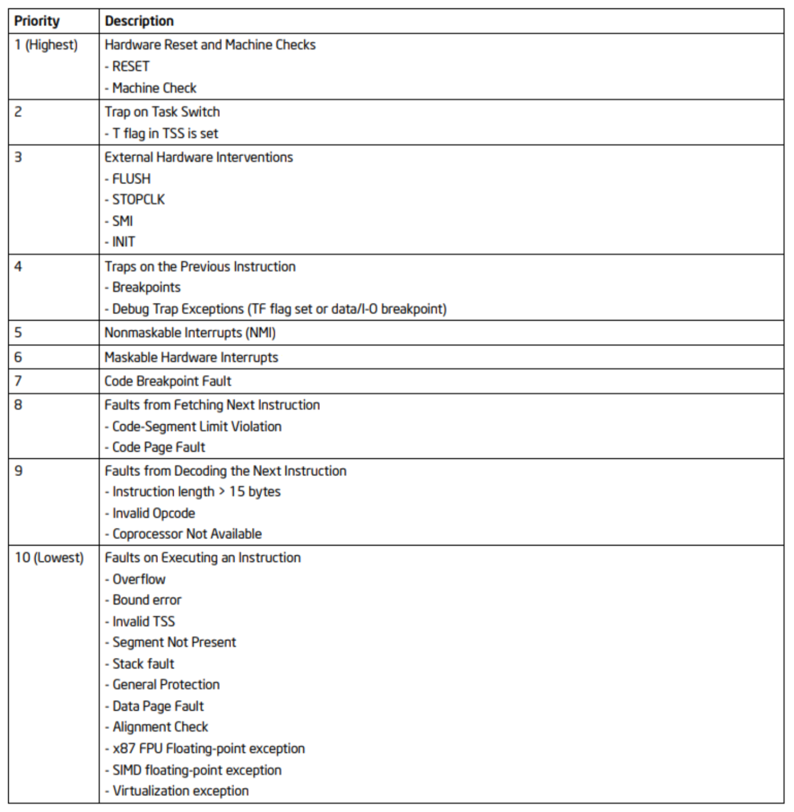

# Interrupciones

Las interrupciones pueden provenir de

- Hardware
- Software
- Internas

Y se identifican mediante un valor numérico de 8 bits denominado *tipo*.
(2^8 = 256 máx.)

## Fuentes

### Hardware

Señales eléctricas enviadas desde los dispositivos de hardware, generalmente
manejadas por un controlador externo que las prioriza y envía a la CPU
secuencialmente de acuerdo a ese criterio.

El **tipo** es provisto por el hardware que interrumpe a través del pin `INTR`.

Asincrónicas y no determinísticas.

### Software

Se producen cuando se ejecuta la instrucción `int <type>`.
Luego el tipo Acompaña al opcode de la instrucción. Por ejemplo, `int 0x80`
en linux.

Determinísticas.

### Internas (Excepciones)

Son conocidas como ***excepciones***. Generadas por la propia CPU como
consecuencia de una situación que le impide completar la ejecución de la
instrucción en curso.
Cada excepción tiene su tipo asociado (predefinido).

_Ej: División por cero, page fault, violación de protección, etc._

#### Clasificación

- **Fault**

    Puede corregirse permitiendo al programa retomar la ejecución de esa
    instrucción sin perder continuidad.
    El procesador guarda en la pila la dirección de la instrucción que
    produjo la falla.

- **Trap**

    Producida inmediatamente a continuación de una instrucción de trap.
    Algunas permite que el procesador retome la ejecución sin perder continuidad
    pero otras no.
    El procesador guarda en la pila la dirección de la instrucción a ejecutarse
    luego de la instrucción trapeada.

- **Abort**

    No siempre puede determinar la instrucción que la causó, ni permite
    recuperar la ejecución de la tarea que la causó.
    Reporta errores severos de hardware o inconsistencias en estructuras de
    datos del sistema.

## IDT

Debe definirse una tabla en memoria llamada `IDT` (Interrupt Descriptor Table)
la cual almacena descriptores de sistema (`S = 0`).

Solo tiene 256 entries ya que esa es la cantidad de tipos que reconoce.

- Interrupt Gate
- Trap Gate
- Task Gate

Si se definen en esta tabla descriptores que no sean esos, se genera una `#GP`
al intentar de vectorizar esa interrupción.

Para llegar a la `IDT`, se usa el registro `IDTR`.

## Vectorización

Se llama **vectorizar** una interrupción al proceso de buscar su rutina de
atención asociada.

En caso de que sea una interrupt o trap gate:

Y si es una task gate

## Privilegios y stack

Cuando el procesador hace `call` a la rutina de atención de interrupción, hay
dos posibilidades, se puede o no realizar un **cambio de privilegio**.

Por ejemplo, si un código nivel usuario es interrumpida, la rutina de atención
será de nivel supervisor, y entonces sucederá un cambio de privilegio.

Al hacerse un cambio de privilegio, **se hace un cambio de stack**.

- Con cambio de privilegio
  - Se obtiene el `SS` y el `ESP` de la `TSS` de la tarea actual (interrumpida).
  - Se pushean en el nuevo stack.
  - Se guarda el estado actual, `EFLAGS`, `CS`, `EIP` en el nuevo stack
  - Si la excepción hace que se guarde un código de error, se pushea.
- Sin cambio de privilegio
  - Se guarda el estado actual, `EFLAGS`, `CS`, `EIP` en el nuevo stack
  - Si la excepción hace que se guarde un código de error, se pushea.

Para retornar de una rutina de atención se debe usar `iret`.

### Código de error

Está compuesto de 3 bits

    0   1   2
    EXT IDT TI

- `EXT`: **External Event**\
  Indica que la excepción fue causada por un evento externo al procesador.

- `IDT`: **Descriptor Location**\
  Indica que el campo Segment Selector Index se refiere a un descriptor de
  gate en la IDT, cuando está en 0 indica que dicho campo se refiere a un
  descriptor en la GDT o en la LDT de la tarea actual.

- `TI`: **Table Indicator** (GDT/LDT)\
  Solo cuando `IDT` está en 0.
  - `0`: GDT
  - `1`: LDT

## Prioridades

Que pasa cuando llega más de una interrupción?

## Tipos predefinidos

Detalle sobre los tipos en la sección 6.15 del manual de Intel
_Systems Programming Guide_.

Vector   | Mnemonic | Description               | Type      | Error Code| Source
-------- | -------- | ------------------------- | --------- | --------- | ------
0        | `#DE`    | Divide Error              | Fault     | No        | `div`, `idiv`
1        | `#DB`    | Debug Exception Fault     | Trap      | No        | Instruction, data, and I/O breakpoints; single-step; and others.
2        | —        | NMI Interrupt             | Interrupt | No        | Nonmaskable external interrupt.
3        | `#BP`    | Breakpoint                | Trap      | No        | `int3` instruction.
4        | `#OF`    | Overflow                  | Trap      | No        | `into` instruction.
5        | `#BR`    | BOUND Range Exceeded      | Fault     | No        | `bound` instruction.
6        | `#UD`    | Invalid Opcode            | Fault     | No        | `ud` instruction or reserved opcode.
7        | `#NM`    | Device Not Available      | Fault     | No        | Floating-point or WAIT/FWAIT instruction.
8        | `#DF`    | Double Fault              | Abort     | Yes (0)   | Any instruction that can generate an exception, an NMI, or an INTR.
9        | -        | Reserved                  | Fault     | No        | Floating-point instruction.
10       | `#TS`    | Invalid TSS               | Fault     | Yes       | Task switch or TSS access.
11       | `#NP`    | Segment Not Present       | Fault     | Yes       | Loading segment registers or accessing system segments.
12       | `#SS`    | Stack-Segment Fault       | Fault     | Yes       | Stack operations and SS register loads.
13       | `#GP`    | General Protection        | Fault     | Yes       | Any memory reference and other protection checks.
14       | `#PF`    | Page Fault                | Fault     | Yes       | Any memory reference.
15       | —        | Intel reserved.           | -         | No        | -
16       | `#MF`    | FPU Error                 | Fault     | No        | x87 FPU floating-point or WAIT/FWAIT instruction.
17       | `#AC`    | Alignment Check           | Fault     | Yes (0)   | Any data reference in memory.
18       | `#MC`    | Machine Check             | Abort     | No        | Error codes (if any) and source are model dependent.
19       | `#XM`    | SIMD FP Exception         | Fault     | No        | SSE/SSE2/SSE3 floating-point instructions.
20       | `#VE`    | Virtualization ex.        | Fault     | No        | EPT violations.
21       | `#CP`    | Control Protection ex.    | Fault     | Yes       | RET, IRET, RSTORSSP, and SETSSBSY instructions can generate this exception. When CET indirect branch tracking is enabled, this exception can be generated due to a missing ENDBRANCH instruction at target of an indirect call or jump.
22-31    | —        | Intel reserved.           | -         | -         | -
32-255   | —        | User Defined              | Interrupt | -         | External interrupt or INT n instruction.

## PIC

{{TODO}}

## Rutinas de atención

Deben realizar

1. Preservar los registros de la tarea interrumpida con `pushad`
2. Si es una interrupción de hardware, llamar `pic_finish` para indicar que
   fue atendida.
3. Realizar la tarea correspondiente
4. Restaurar los registros con `popad`
5. Retornar de la interrupción con `iret`
