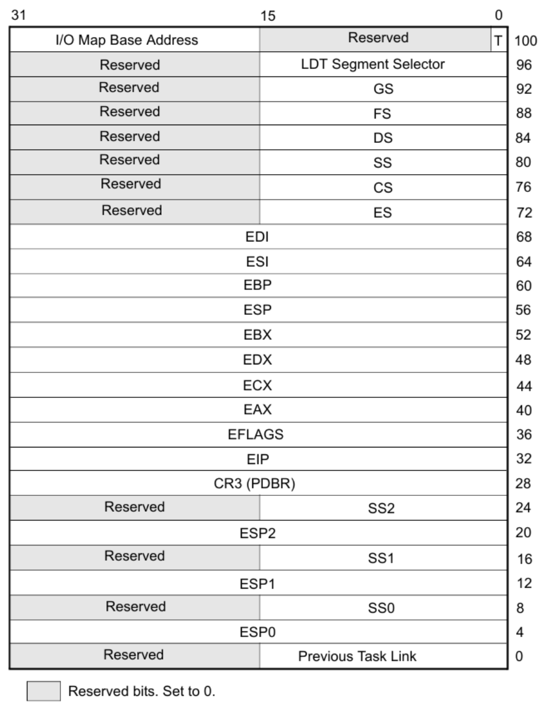
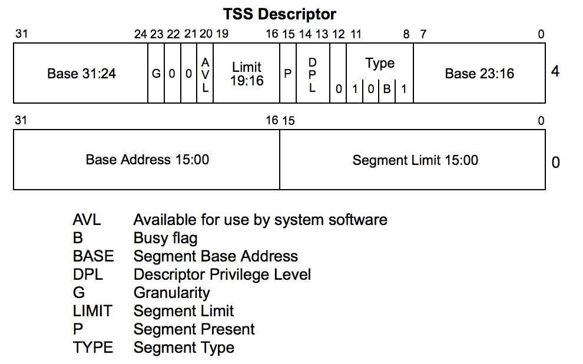
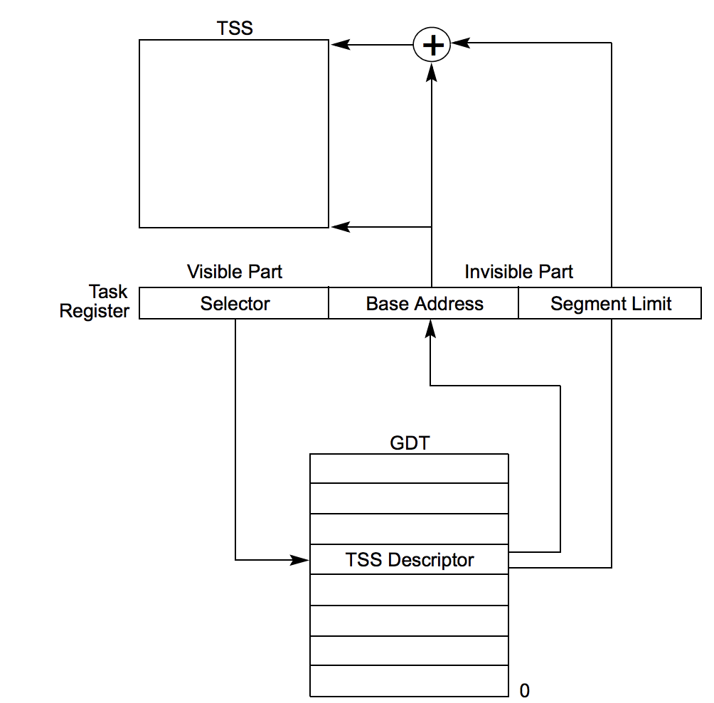
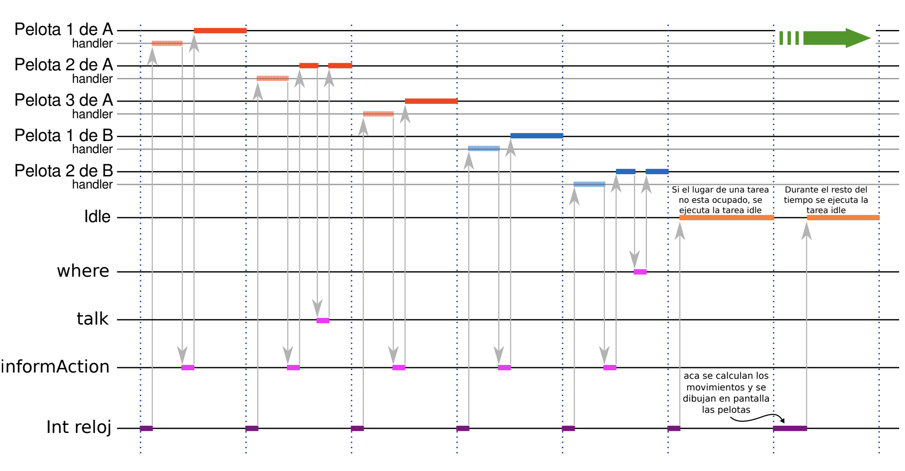

# Tareas

El SO tiene un scheduler que se encarga de conmutar entre una lista de tareas
a ejecutar, ejecutando cada una por un intervalo fijo de tiempo, por lo general
atado a interrupciones del clock.

- **Tarea**: Es una unidad de trabajo que un procesador puede despachar,
  ejecutar, y detener a voluntad.
- **Espacio de ejecución**: Es el conjunto de segmentos de código, datos y pila
  que componen a la tarea.
- **Contexto de ejecución**: Es el conjunto de valores de los registros internos
  del procesador. Para poder suspender la ejecución de una tarea y poder
  resumirla, es necesario almacenarlo.
- **Espacio de contexto**: Donde es almacenado el contexto de ejecución.

## Estructuras

### TSS

La TSS (Task State Segment) Es el lugar de memoria donde se guarda el contexto
de cada tarea, su tamaño mínimo es `0x68` (su mínimo Limit es `0x67`).



El `EFLAGS` por defecto es `0x00000002` y con interrupciones habilitadas es
`0x00000202`.

### Descriptor de TSS



El bit `B` (Busy) sirve para evitar recursividad en el anidamiento de tareas.

### TR

En el Task Register se guarda selector de segmento de la GDT donde reside el
descriptor de TSS de la tarea actual.



Se modifica mediante las instrucciones

    ltr     Load Task Register
    str     Store Task Register

Por ejemplo

    mov ax, <selector>
    ltr ax

## Despacho

El procesador puede despachar tareas de las siguientes formas:

- `call` a la tarea.
- `jmp` a la tarea.
- Call a un interrupt-handler task (procesador)
- Call a un exception-handler task (procesador)
- Return con `iret` cuando está prendido el flag `NT` de `EFLAGS`

Por ejemplo, con un `jmp`

```x86asm
jmp 0x20:0  ; El offset no importa
```

Pero si quisieramos hacerlo a un selector que no se puede poner como constante,
es necesario hacerlo pasándolo por memoria. Esto es porque es de 48 bits.

```x86asm
selector:   0x0000
offset:     0x00000000

mov ax, selector
jmp far [offset]        ; hacemos jmp a offset porque lo lee como little endian
```

## Primera tarea

Para despachar la primera tarea, es necesario crear una **tarea inicial** para
proveer una TSS en donde el procesador pueda guardar el contexto al momento
de conmutar la primera.

## Conmutación

- El procesador analiza el valor que se debe colocar en el registro CS como
  parte de la ejecución de un `jmp`, `call` o `iret` (con NT = 1).
  o al que obtiene de una interrupt gate o trap gate.
- Busca el descriptor de la TSS en la GDT
- Si es un Task Gate, vuelve a buscar en la GDT donde debe encontrar un
  descriptor de TSS.
- Si es un selector de TSS lo que intenta cargarse en el CS, busca en la GDT
  el descriptor de TSS.
- Emplea el TSS actual para almacenar el estado del procesador.
- Setea el bit `CR0.TS` (Task Switch)
- Carga el nuevo TR y descriptor
- Aplica el contexto almacenado en el nuevo TSS.
  
## Anidamiento

{{TODO}}

## Registros XMM

Los registros xmm no están en la TSS, ya que aumentaría los tiempos de
conmutación entre tareas.

Lo que hace entonces el procesador, es que cada vez que ejecuta una instrucción
que utiliza algún registro xmm, se fija si se realizó un task switch viendo
el bit `CR0.TS`. Si hubo, genera una excepción `#NM`, en cuyo handler se
switchea el banco de registros, y se limpia `CR0.TS`.

Para esto se usan las instrucciones

    fxsave  Guarda en memoria todos los registros xmm (bloque de 512 bytes)
    fxstr   Recupera de memoria los registros xmm

## Scheduler

Ejemplo del juego


