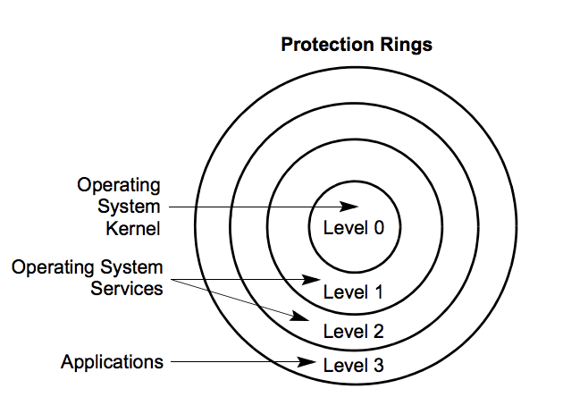
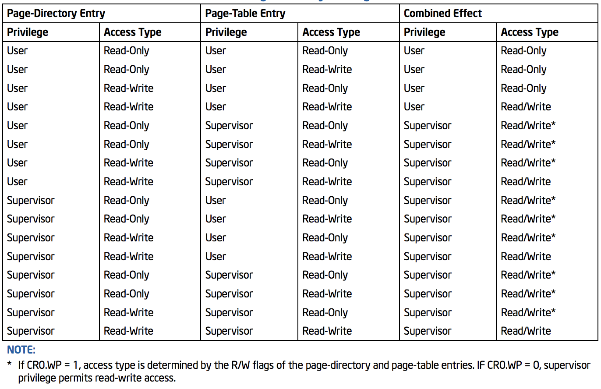

# Protección

Cuando el procesador pasa a _modo protegido_ se pone en funcionamiento la
**unidad de protección**. Esta supervisa las operaciones internas del
procesador, comprobando el cumplimiento de una serie de reglas que constituyen
el entorno de protección necesario para implementar de manera eficiente la
multitarea.

Cubren los siguientes chequeos

- Segmentos
  - Limite
  - Tipo
- Privilegios de segmentos y páginas
- Restricción del dominio de direccionamiento a las tareas
- Restricción de los puntos de entrada a los procedimientos
- Restricción en el uso del set de instrucciones.

## Segmentos

### Limite

Tiene en cuenta los atributos `G`, `D/B` y `ED`.
Se le llama límite efectivo al resultado de tener todo eso en cuenta.

#### Sin ED

El limite efectivo será la última dirección a la cual se puede acceder dentro
del segmento.

Se fija que el offset al que se quiere acceder no sea mayor al límite **efectivo**. Caso contrario, se genera una excepción `#GP`.

Ejemplos:

- Un `byte` cuyo offset sea mayor al limite efectivo.
- Una `word` cuyo offset sea mayor al limite efectivo - 1.
- Una `quadword` cuyo offset sea mayor que limite efectivo - 7.

#### Con ED

El limite efectivo es el último offset que no puede ser accedido ya que genera
una `#GP`.

El rango de offsets validos va de

- `D/B = 0`: (limite efectivo + 1) a `0xFFFF`
- `D/B = 1`: (limite efectivo + 1) a `0xFFFFFFFF`

Son usados para pilas.

### Tipo

Se toma en cuenta el atributo `S`.

No está permitido a la hora de cargar un segmento:

- Cargar en `CS` un selector cuyo descriptor corresponda a uno de datos.
- Cargar en `SS` o uno de datos (`DS`, `ES`, ...) un selector cuyo
  descriptor corresponda a uno de código con `R=0`.
- Cargar en `SS` un selector cuyo descriptor de segmento corresponde a uno de
  datos con `W=0`.
- Cargar en `LDTR` un selector que no corresponda a un descriptor de `LDT`.
- Cargar en `TR` un selector que no corresponda a un descriptor de TSS.

Durante la ejecución de instrucciones que acceden a segmentos con selectores
ya cargados:

- No se puede escribir en un segmento de código.
- No se puede escribir dentro de un segmento de datos con `W=0`.
- No se puede leer un segmento de código si `R=0`.

### Selectores nulos

Asignar un selector de segmento nulo en los registros de segmento `CS` o `SS`
genera una excepción `#GP`.

Sin embargo, se puede asignar a `DS`, `ES`, `FS` o `GS`. Pero al intentar
acceder al segmento, generará la excepción `#GP`.

Esto puede ser útil para detectar accesos a registros de segmento no utilizados,
o para prevenir accesos no deseados a segmentos de datos.

### Privilegios

Lo menor numérico es lo más privilegiado.
El uso real que tienen es que todo lo kernel es 0, user 3, y el medio no se usa.

Los accesos entre segmentos están regidos por reglas que contemplan los niveles
de privilegio. Se chequean cuando se carga el selector en el registro de
segmento.

#### Tipos

- `DPL`: **Descriptor Privilege Level**\
  Nivel de privilegio del segmento a ser accedido (especificado en el
  descriptor).

  - Datos / Call Gate / TSS: Indica el máximo valor numérico (min privilegio)
    que debe tener el código de una tarea para acceder.
  - Codigo **no conforming**: Nivel que debe tener una tarea para accederlo,
    **exactamente**.
  - Codigo conforming: Indica el mínimo valor numérico que debe tener el código
    para poder acceder al apuntado.

- `CPL`: **Current Privilege Level**\
  Nivel de privilegio del segmento de código que estamos ejecutando.
  El procesador lo mantiene en el caché hidden del selector, ya que se lo
  leyó directo de la tabla de descriptores.

- `RPL`: **Requested Privilege Level**\
  Es el valor que se escribe en los primeros dos bits de los selectores.
  Este puede ser cambiado por el programador.

- `EPL`: **Effective Privilege Level**\
  Se queda con el *menos* privilegiado entre el `CPL` y el `RPL`. (Es decir,
  el máximo numérico)

    EPL = Max(CPL, RPL)

  Esto quiere decir que una tarea no puede hacerse la viva y poner que es kernel
  cuando en realidad es user, porque el CPL lo toma de una caché oculta que no
  tiene forma de modificar. Por lo tanto su EPL seguirá siendo 3.

#### Nivel adecuado

Para saber si tenemos el nivel adecuado,

- Segmento de datos: `EPL <= DLP`
- Segmento de código:
  - Non-conforming: `EPL = DPL`
  - Conforming: `CPL >= DPL`

Donde las comparaciones son por valor numérico. Si no se cumple alguna, `#GP`.

## Paginación

### Privilegios

Se combina con segmentación.

Hay dos niveles

- `U/S = 0`: **Usuario** (Corresponde a CPL 0, 1, 2)
- `U/S = 1`: **Supervisor** (CPL 3)

Cualquier violación al sistema de protección de páginas genera un `#PF`.

- El modo supervisor puede acceder a todas las páginas, y en modo usuario solo
  a las que son de usuario.
- El modo supervisor también puede escribir en cualquier página, aunque sea
  read only (`R/W = 0`).

  Para evitar esto, hay un bit en CR0, `CR0.WP` (_Write Protect_). Cuando está
  en 1 impide que el procesador escriba en una página Read Only.

- El procesador chequea la protección en el _Page Directory_ y también en cada
  _Page Table_.

#### Combinación

## Interrupciones

Se tiene el privilegio necesario para hacer `int <type>` si `CPL <= DPL`,
tomando el `DPL` del descriptor de la IDT. Sino `#GP`.\
Al tratarse de interrupciones por hardware, se ignoran los bits de `DPL`.

## Tareas

Para ver si se puede efectuar la conmutación, `CPL <= DPL`, tomando el `DPL` del
descriptor de la TSS.\
También es necesario que `B = 0` (i.e que no esté corriendo ya).

Sino, `#GP`.

## Instrucciones

El Registro `EFLAGS` contiene el campo `IOPL` (bits 12 y 13) que determina el
nivel de privilegio que debe tener la tarea en curso para acceder a la E/S.
Luego pueden ejecutarse `IN`, `OUT`, `INS`, `OUTS`, sii CPL = IOPL.

Las instrucciones que en modo protegido solo pueden ejecutarse desde privilegio
0 son:

- `LGDT` - Cargar registro GDTR
- `LLDT` - Cargar registro LDTR
- `LTR` - Cargar registro TR
- `LIDT` - Cargar Registro IDTR
- `MOV` - si destino es un Registro deControl
- `MOV` - si destino es un Registro de Debug
- `LMSW` - Escribir en el Machine Status
- `Word` (parte baja de CR0)
- `CLTS` - Clear Flag Task-Switched en CR0
- `INVD` - Invalidar Cache sin Write Back
- `WBINVD` - Invalidar Cache con Write Back
- `INVLPG` - Invalidar entrada de la TLB
- `HLT` - Parar el procesador
- `RDMSR` - Leer Model Specific Register
- `WRMSR` - Escribir Model Specific Register
- `RDPMC` - Leer Contador de Monitoreo de Performance
- `RDTSC` - Leer Time Stamp Counter
